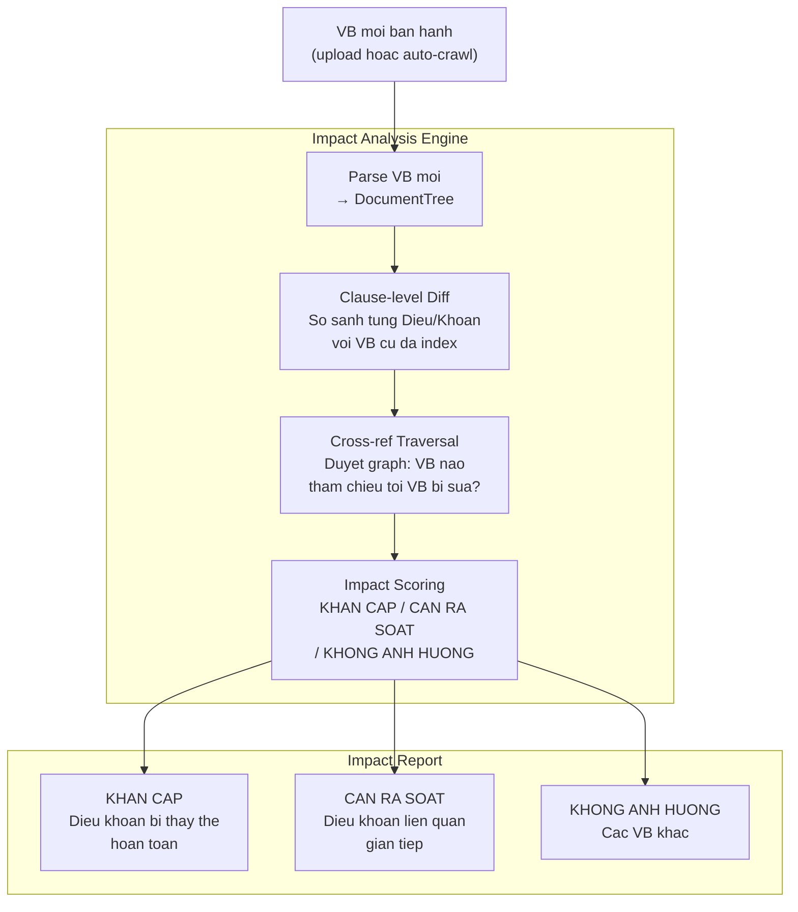
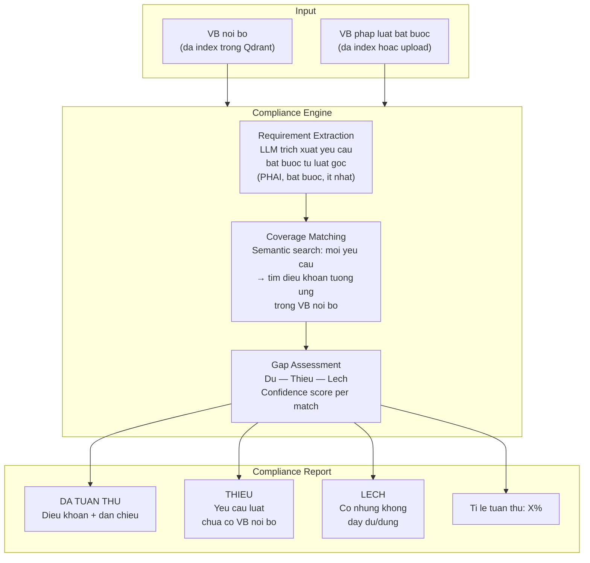
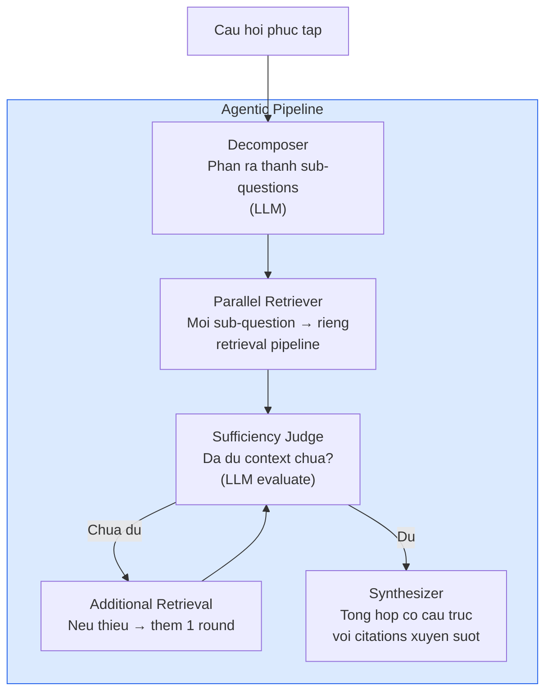
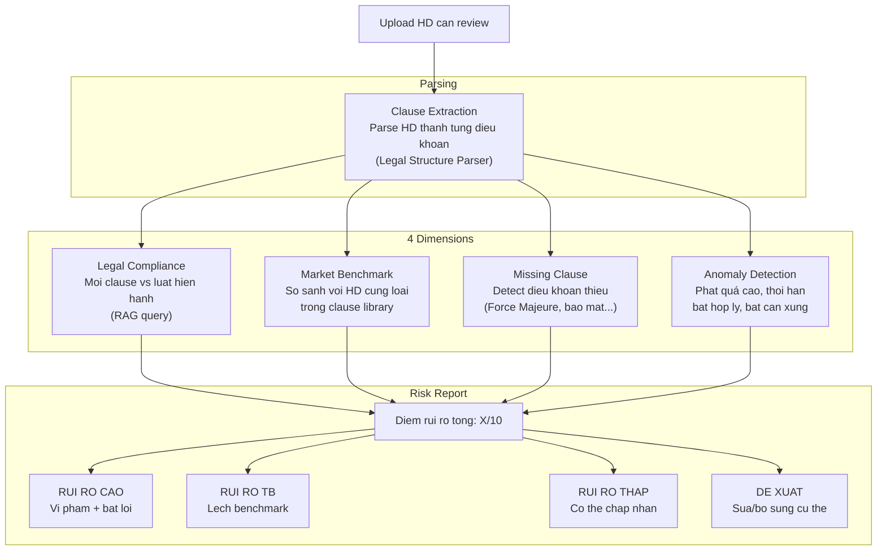
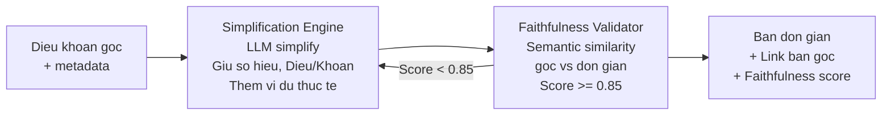
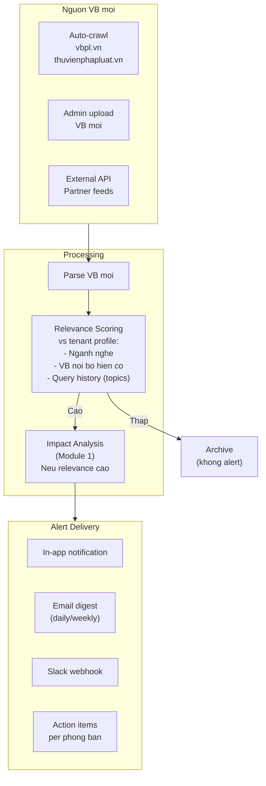
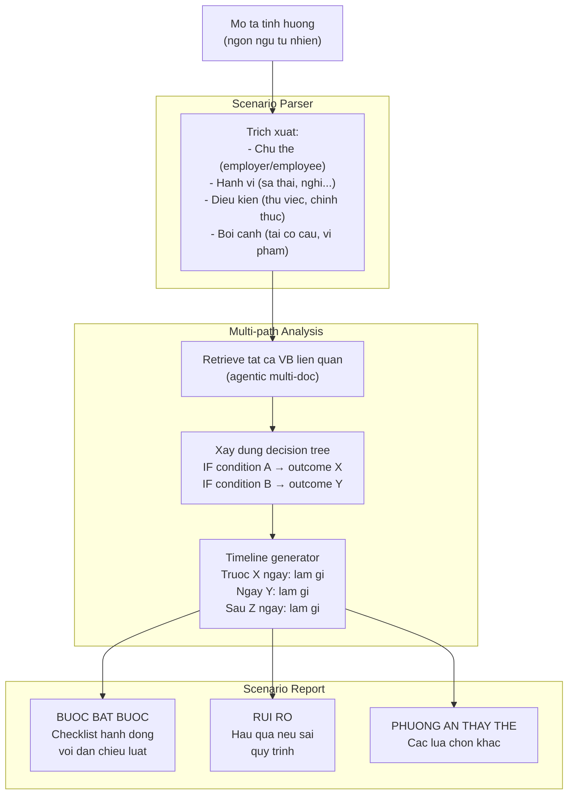
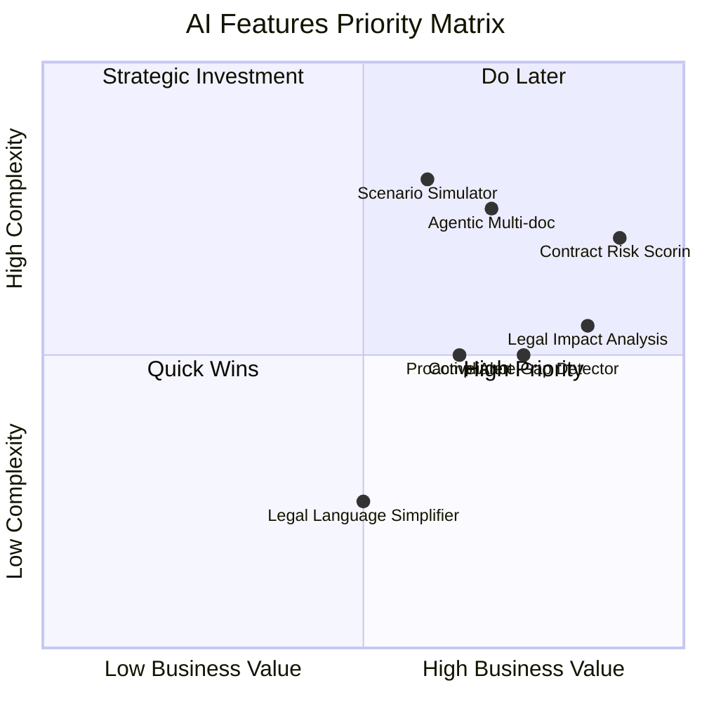

# AI Features -- Tinh nang AI nang cao

Cac tinh nang AI tao su khac biet cho Legal Intelligence Platform. Moi tinh nang duoc thiet ke de tan dung nen tang RAG hien co (hierarchical chunking, cross-reference graph, Vietnamese NLP).

---

## 1. Legal Impact Analysis -- Phan tich tac dong phap ly

### Muc dich

Khi van ban phap luat moi ban hanh (vd: Nghi dinh sua doi), tu dong phan tich van ban noi bo nao bi anh huong, o muc clause-level.

### Kien truc



### Implementation

```python
class LegalImpactAnalyzer:
    """Phan tich tac dong cua VB moi len VB noi bo da index."""

    async def analyze(
        self,
        new_doc_tree: DocumentTree,
        new_doc_meta: DocumentMetadata,
    ) -> ImpactReport:
        # 1. Tim VB cu ma VB moi thay the/sua doi (tu metadata hoac header)
        old_doc_refs = self._extract_amended_targets(new_doc_tree)

        # 2. Clause-level diff: moi Dieu trong VB moi vs VB cu
        clause_diffs = []
        for article in self._extract_articles(new_doc_tree):
            old_article = await self._find_matching_article(
                article.number, old_doc_refs
            )
            if old_article:
                diff = self._diff_clauses(old_article, article)
                clause_diffs.append(diff)

        # 3. Cross-reference traversal
        affected_docs = await self._find_referencing_docs(old_doc_refs)

        # 4. Score impact per affected document
        impacts = []
        for doc in affected_docs:
            score = self._score_impact(doc, clause_diffs)
            impacts.append(score)

        return ImpactReport(
            new_document=new_doc_meta,
            clause_diffs=clause_diffs,
            affected_documents=impacts,
        )
```

### Data requirements

- Cross-reference graph (da co tu ingestion pipeline)
- Document relationships table (PostgreSQL)
- Qdrant article-level search (da co payload indexes)

---

## 2. Compliance Gap Detector -- Phat hien lo hong tuan thu

### Muc dich

So sanh VB noi bo cua doanh nghiep voi yeu cau phap luat bat buoc, phat hien dieu khoan thieu hoac chua day du.

### Kien truc



### Requirement extraction prompt

```
Trich xuat tat ca yeu cau bat buoc tu van ban phap luat sau.
Chi lay nhung quy dinh co tu khoa: "phai", "bat buoc", "it nhat",
"khong duoc", "cam", "toi thieu", "toi da".

Voi moi yeu cau, tra ve:
- Dieu/Khoan/Diem cu the
- Noi dung yeu cau (tom tat 1-2 cau)
- Doi tuong ap dung (ai phai tuan thu)
- Muc do bat buoc (bat_buoc / khuyen_nghi)

Tra ve JSON array.
```

### Use cases

1. **Kiem tra Noi quy lao dong vs Bo luat Lao dong 2019 Dieu 118**
   - Dieu 118 liet ke 7 noi dung bat buoc trong noi quy
   - System check tung noi dung da co trong noi quy chua

2. **Kiem tra quy che tai chinh vs Luat Ke toan 2015**
   - Cac yeu cau ve so sach, bao cao, luu tru

3. **Kiem tra HD mau vs BLLD 2019 Dieu 21**
   - Dieu 21 liet ke noi dung bat buoc trong HDLD

---

## 3. Multi-document Legal Reasoning (Agentic RAG)

### Muc dich

Tra loi cau hoi phuc tap can tong hop tu nhieu van ban, voi kha nang tu phan ra cau hoi va truy xuat nhieu nguon.

### Kien truc



### Vi du

**Cau hoi:** "Cong ty muon cho NV nghi viec do tai co cau. Can thuc hien nhung buoc gi, bao gom nghia vu tai chinh?"

**Decomposition:**
1. "Can cu phap ly cho nghi viec do tai co cau?" → BLLD Dieu 42
2. "Nghia vu thong bao truoc bao lau?" → BLLD Dieu 45 + ND 145
3. "Tro cap thoi viec tinh the nao?" → BLLD Dieu 46, 48
4. "Quy trinh noi bo cong ty?" → Noi quy Dieu 28

**Sufficiency check:** "Da cover tai co cau, thong bao, tro cap. Thieu: nghia vu voi cong doan (Dieu 42 K.3)" → Trigger them retrieval

### Implementation notes

- Max decomposition: 5 sub-questions
- Max retrieval rounds: 2 (tranh loop)
- Parallel retrieval per sub-question (asyncio.gather)
- Final synthesis temperature 0.05 (strict grounding)

---

## 4. Contract Risk Scoring + Clause Anomaly Detection

### Muc dich

Review hop dong tu doi tac, phat hien dieu khoan bat loi, thieu, hoac vi pham phap luat.

### Kien truc



### Benchmark database

Clause library duoc xay dung tu:
- Template hop dong chuan cua doanh nghiep
- Hop dong da review truoc do (anonymized)
- Dieu khoan mau tu cac nguon phap ly

Moi clause luu voi metadata: `clause_type`, `typical_range` (vd: phat vi pham 5-10%), `required` (bool), `legal_basis` (Dieu/Khoan lien quan).

### Risk scoring formula

```
risk_score = (
    legal_violations * 3.0 +      # Nang nhat: vi pham luat
    missing_required * 2.0 +       # Thieu dieu khoan bat buoc
    anomaly_count * 1.5 +          # Bat thuong so voi benchmark
    unfavorable_terms * 1.0        # Dieu khoan bat loi
) / max_possible_score * 10
```

---

## 5. Legal Language Simplifier -- Dich thuat phap ly

### Muc dich

Chuyen doi ngon ngu phap ly phuc tap thanh ngon ngu thuong, giu chinh xac phap ly.

### Kien truc



### Simplification prompt

```
Dich doan van ban phap ly sau sang ngon ngu thuong cho nguoi
khong chuyen luat hieu duoc.

QUY TAC:
1. Giu nguyen so hieu van ban, Dieu/Khoan/Diem
2. Giu nguyen y nghia phap ly chinh xac
3. Them vi du cu the neu co the
4. Dung bullet points cho nhieu muc
5. Giai thich thuat ngu phap ly trong ngoac
6. Khong them y kien ca nhan

Van ban goc ({doc_number}, {hierarchy_path}):
{original_text}

Ban don gian:
```

### Faithfulness validation

So sanh semantic giua ban goc va ban don gian:
- Embedding similarity >= 0.85 → PASS
- NER check: tat ca entity (so hieu, ngay, so tien) phai xuat hien trong ban don gian
- Negation check: khong duoc dao nghia (vd: "cam" → "duoc phep")

---

## 6. Proactive Legal Alert System

### Muc dich

Tu dong phat hien VB phap luat moi anh huong toi tenant va thong bao kip thoi.

### Kien truc



### Relevance scoring

```python
def score_relevance(new_doc, tenant_profile):
    score = 0.0

    # 1. Industry match (linh_vuc)
    if overlap(new_doc.linh_vuc, tenant_profile.industries):
        score += 3.0

    # 2. Doc type match (cung loai VB noi bo da co)
    if new_doc.doc_type in tenant_profile.existing_doc_types:
        score += 2.0

    # 3. Topic similarity (embedding vs tenant's VB noi bo)
    topic_sim = cosine_similarity(
        embed(new_doc.summary),
        tenant_profile.topic_centroid,
    )
    score += topic_sim * 3.0

    # 4. Query history (tenant hay hoi ve topic nay)
    if new_doc.topics & tenant_profile.frequent_query_topics:
        score += 2.0

    return score / 10.0  # normalize 0-1
```

### Alert configuration per tenant

| Setting | Mo ta | Default |
|---------|-------|---------|
| `alert_threshold` | Score toi thieu de alert | 0.5 |
| `delivery_channels` | In-app, email, slack | in-app |
| `frequency` | Real-time, daily digest, weekly | daily |
| `departments_filter` | Chi alert cho phong ban lien quan | all |
| `doc_types_filter` | Chi theo doi loai VB nao | all |

---

## 7. Legal Scenario Simulator

### Muc dich

Tra loi cau hoi dang "Neu...thi..." (what-if) bang cach phan tich nhieu VB va xay dung decision tree.

### Kien truc



### Vi du scenarios

1. "Cong ty muon cho NV nghi viec do tai co cau"
2. "NV nghi viec khong bao truoc, cong ty xu ly the nao"
3. "Cong ty muon thay doi gio lam viec"
4. "NV bi tai nan lao dong, trach nhiem cua cong ty"
5. "Cong ty muon ky HD thoi vu thay vi chinh thuc"

### Scenario parser prompt

```
Phan tich tinh huong phap ly sau va trich xuat:

1. CHU THE: Ai la ben thuc hien hanh vi (employer/employee/ca hai)
2. HANH VI: Hanh dong cu the (sa thai, nghi viec, ky HD, thay doi...)
3. DIEU KIEN: Trang thai hien tai (thu viec, chinh thuc, hop dong xac dinh thoi han...)
4. BOI CANH: Ly do/hoan canh (tai co cau, vi pham ky luat, thoa thuan...)
5. CAU HOI CHINH: Nguoi dung muon biet gi (quy trinh, hau qua, nghia vu tai chinh...)

Tra ve JSON.

Tinh huong: {scenario_text}
```

---

## 8. Ma tran uu tien phat trien



### Thu tu trien khai khuyen nghi

| Uu tien | Tinh nang | Ly do |
|---------|-----------|-------|
| P0 | Legal Language Simplifier | Complexity thap, wow effect cao, lam truoc |
| P0 | Legal Impact Analysis | Gia tri kinh doanh cao nhat, nen tang cross-ref da co |
| P1 | Contract Risk Scoring | Revenue driver cho contract drafting module |
| P1 | Compliance Gap Detector | Gia tri cao cho enterprise, dung RAG san co |
| P1 | Proactive Alert | Retention feature, dung Impact Analysis da build |
| P2 | Agentic Multi-doc | Complex nhung cai thien chat luong Q&A |
| P2 | Scenario Simulator | Can Agentic RAG da build truoc |

---

## 9. Shared AI Infrastructure

Cac tinh nang tren chia se chung:

| Component | Dung boi | Mo ta |
|-----------|---------|-------|
| RAG Pipeline | Tat ca | Vector search + rerank + LLM |
| Structure Parser | Impact, Risk, Gap | Parse VB thanh Dieu/Khoan tree |
| Cross-ref Graph | Impact, Alert, Agentic | Quan he giua VB |
| Embedding Service | Tat ca | Voyage AI shared client |
| LLM Service | Tat ca | DeepSeek/OpenAI shared client |
| Clause Library | Risk, Drafting | Vector DB dieu khoan mau |
| Audit Logger | Tat ca | PostgreSQL audit trail |
