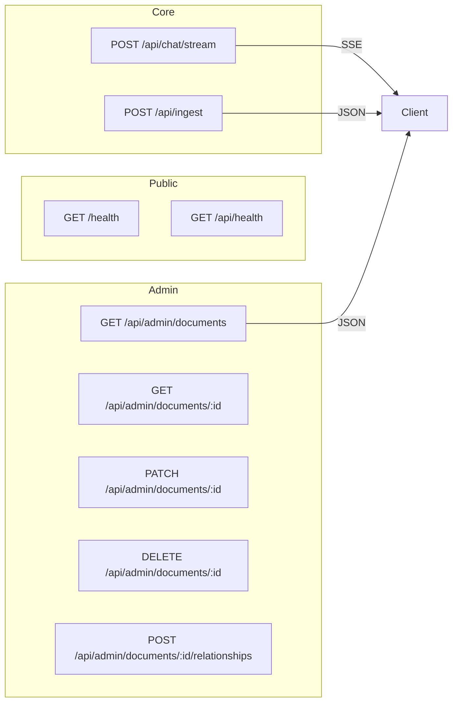

# API Reference

Dac ta cac HTTP endpoint cua Legal Intelligence Platform. Backend chay tren FastAPI voi SSE streaming cho chat.

## Base URL

```
Backend:  http://localhost:8000
Frontend: http://localhost:3000  (proxy /api/* -> backend)
```

## Endpoints



**Route files:**

| File | Endpoints |
|------|-----------|
| `backend/src/api/routes/chat.py` | POST /api/chat/stream |
| `backend/src/api/routes/ingest.py` | POST /api/ingest |
| `backend/src/api/routes/health.py` | GET /health, GET /api/health |
| `backend/src/api/routes/admin.py` | /api/admin/* (5 endpoints) |

---

## POST /api/chat/stream

Gui cau hoi, nhan cau tra loi streaming qua Server-Sent Events (SSE).

**Content-Type:** `application/json`

### Request Body

```json
{
  "question": "Quy dinh nghi phep nam cua nhan vien chinh thuc?",
  "language": "vi",
  "conversation_id": "optional-uuid",
  "conversation_history": [],
  "user_context": {
    "user_id": "user-001",
    "departments": ["hr", "all"],
    "access_levels": ["public", "internal"],
    "role": "nhan_vien"
  }
}
```

| Field | Type | Required | Default | Mo ta |
|-------|------|----------|---------|-------|
| `question` | string | **Yes** | -- | Cau hoi cua nguoi dung |
| `language` | string | No | `"vi"` | Ngon ngu tra loi |
| `conversation_id` | string | No | auto UUID | ID cuoc hoi thoai |
| `conversation_history` | array | No | `[]` | Lich su hoi thoai (Phase 1: chua su dung) |
| `user_context` | object | No | `null` | Thong tin phan quyen nguoi dung |

**UserContext fields:**

| Field | Type | Default | Mo ta |
|-------|------|---------|-------|
| `user_id` | string | `"anonymous"` | Dinh danh nguoi dung |
| `departments` | array[string] | `["all"]` | Phong ban duoc phep |
| `access_levels` | array[string] | `["public"]` | Cap do truy cap |
| `role` | string | `"nhan_vien"` | Vai tro |

### Response (SSE Stream)

**Content-Type:** `text/event-stream`

**Event 1 -- Token chunks** (nhieu events):

```
data: {"type": "chunk", "data": "Theo "}

data: {"type": "chunk", "data": "Dieu 12 "}

data: {"type": "chunk", "data": "Noi quy..."}
```

**Event 2 -- Done** (1 event cuoi cung):

```
event: done
data: {"confidence":85.5,"groundedness":0.0,"sources_count":5,"citations":[...],"has_expired_sources":false,"has_conflicts":false,"validity_warnings":[],"conversation_id":"uuid-..."}
```

**Event 3 -- Error** (neu co loi):

```
event: error
data: {"error": "Loi he thong: ..."}
```

### Done Event Schema

| Field | Type | Mo ta |
|-------|------|-------|
| `confidence` | float | Do tin cay (0-100), dua tren rerank score |
| `groundedness` | float | Do bam sat nguon (Phase 2) |
| `sources_count` | int | So nguon duoc su dung |
| `citations` | array | Danh sach trich dan chi tiet |
| `has_expired_sources` | bool | Co nguon het hieu luc? |
| `has_conflicts` | bool | Co mau thuan giua cac nguon? |
| `validity_warnings` | array[string] | Canh bao ve hieu luc |
| `conversation_id` | string | ID cuoc hoi thoai |

### Citation Object Schema

| Field | Type | Mo ta |
|-------|------|-------|
| `doc_title` | string | Ten van ban |
| `doc_number` | string | So hieu van ban |
| `doc_type` | string | Loai van ban (DocType enum) |
| `article` | string? | "Dieu X" |
| `clause` | string? | "Khoan Y" |
| `point` | string? | "Diem Z" |
| `hierarchy_path` | string | "Chuong II > Dieu 12 > Khoan 1" |
| `exact_quote` | string | Trich nguyen van (max 500 ky tu) |
| `issuing_authority` | string | Co quan ban hanh |
| `effective_date` | string? | Ngay hieu luc (YYYY-MM-DD) |
| `validity_status` | string | "hieu_luc" / "het_hieu_luc" / "da_sua_doi" |
| `amended_status` | string | "original" / "amended" |

### Vi du curl

```bash
curl -N -X POST http://localhost:8000/api/chat/stream \
  -H "Content-Type: application/json" \
  -d '{
    "question": "Quy dinh nghi phep nam cua nhan vien chinh thuc?",
    "language": "vi"
  }'
```

---

## POST /api/ingest

Nap van ban moi vao he thong. Nhan file upload va metadata tuy chon.

**Content-Type:** `multipart/form-data`

### Request

| Field | Type | Required | Mo ta |
|-------|------|----------|-------|
| `file` | file | **Yes** | File van ban (PDF, DOCX, HTML, TXT) |
| `metadata` | string (JSON) | No | Metadata override (JSON string) |

**Metadata override fields:**

```json
{
  "doc_number": "NQ-HR-2025-001",
  "doc_title": "Noi quy lao dong 2025",
  "doc_type": "noi_quy",
  "issuing_authority": "Ban Giam doc",
  "effective_date": "2025-01-01",
  "status": "hieu_luc",
  "scope": ["toan_cong_ty"],
  "access_level": "public",
  "allowed_departments": ["all"]
}
```

Tat ca fields la optional. He thong tu dong detect neu khong truyen:
- `doc_type`: detect tu title keywords hoac doc_number prefix
- `doc_number`: extract tu header van ban
- `doc_title`: extract tu dong tieu de
- `access_level`: ap dung ACL mac dinh theo `doc_type`

Admin override co uu tien cao nhat.

### Response

```json
{
  "success": true,
  "doc_id": "550e8400-e29b-41d4-a716-446655440000",
  "chunks_created": 47,
  "structure_detected": "legal_standard",
  "articles_found": 35,
  "cross_references_found": 12,
  "warnings": []
}
```

| Field | Type | Mo ta |
|-------|------|-------|
| `success` | bool | Ket qua nap thanh cong? |
| `doc_id` | string (UUID) | ID van ban trong he thong |
| `chunks_created` | int | So chunks da tao |
| `structure_detected` | string | Loai cau truc nhan dien duoc |
| `articles_found` | int | So Dieu nhan dien duoc |
| `cross_references_found` | int | So tham chieu cheo tim duoc |
| `warnings` | array[string] | Canh bao (vd: PDF scanned) |

### Vi du curl

```bash
curl -X POST http://localhost:8000/api/ingest \
  -F "file=@data/samples/noi-quy-lao-dong.pdf" \
  -F 'metadata={"doc_number":"NQ-HR-2025-001","doc_title":"Noi quy lao dong 2025","doc_type":"noi_quy","effective_date":"2025-01-01","access_level":"public","allowed_departments":["all"]}'
```

---

## GET /health

Health check don gian.

### Response

```json
{
  "status": "ok"
}
```

---

## GET /api/health

Health check chi tiet, kiem tra ket noi toi PostgreSQL, Qdrant va Redis.

### Response

```json
{
  "status": "ok",
  "qdrant": "connected",
  "redis": "connected",
  "postgres": "connected"
}
```

| Field | Gia tri | Mo ta |
|-------|---------|-------|
| `status` | `"ok"` / `"degraded"` | `"degraded"` khi Qdrant hoac PostgreSQL khong kha dung |
| `qdrant` | `"connected"` / `"unavailable"` | Trang thai ket noi Qdrant |
| `redis` | `"connected"` / `"unavailable"` | Trang thai ket noi Redis (optional) |
| `postgres` | `"connected"` / `"unavailable"` | Trang thai ket noi PostgreSQL |

---

## Admin API

Cac endpoint quan ly tai lieu, luu tru trong PostgreSQL. Route file: `backend/src/api/routes/admin.py`.

### GET /api/admin/documents

Danh sach tai lieu voi filter.

**Query Parameters:**

| Param | Type | Default | Mo ta |
|-------|------|---------|-------|
| `doc_type` | string | `null` | Filter theo loai VB |
| `status` | string | `null` | Filter theo trang thai |
| `limit` | int | `50` | So luong ket qua |
| `offset` | int | `0` | Bat dau tu vi tri |

**Response:**

```json
{
  "items": [
    {
      "id": "uuid",
      "doc_number": "NQ-HR-2025-001",
      "doc_title": "Noi quy lao dong 2025",
      "doc_type": "noi_quy",
      "status": "hieu_luc",
      "issuing_authority": "Ban Giam doc",
      "effective_date": "2025-01-01",
      "chunks_count": 47,
      "created_at": "2025-04-13T10:00:00"
    }
  ],
  "total": 1
}
```

### GET /api/admin/documents/{doc_id}

Chi tiet 1 tai lieu (toan bo metadata).

**Response:**

```json
{
  "id": "uuid",
  "doc_number": "NQ-HR-2025-001",
  "doc_title": "Noi quy lao dong 2025",
  "doc_type": "noi_quy",
  "status": "hieu_luc",
  "issuing_authority": "Ban Giam doc",
  "issue_date": "2025-01-01",
  "effective_date": "2025-01-01",
  "expiry_date": null,
  "legal_hierarchy": 5,
  "access_level": "public",
  "allowed_departments": ["all"],
  "chunks_count": 47,
  "structure_detected": "legal_standard",
  "original_file_path": "/path/to/file",
  "extra_metadata": {}
}
```

### PATCH /api/admin/documents/{doc_id}

Cap nhat metadata tai lieu. Chi gui fields can thay doi.

**Request Body:**

```json
{
  "doc_title": "Noi quy lao dong 2025 (cap nhat)",
  "status": "da_sua_doi"
}
```

| Field | Type | Mo ta |
|-------|------|-------|
| `doc_title` | string? | Ten tai lieu |
| `doc_type` | string? | Loai tai lieu |
| `status` | string? | Trang thai hieu luc |
| `issuing_authority` | string? | Co quan ban hanh |
| `access_level` | string? | Cap do truy cap |
| `allowed_departments` | string[]? | Departments duoc phep |

**Response:**

```json
{"status": "updated", "id": "uuid"}
```

### DELETE /api/admin/documents/{doc_id}

Xoa tai lieu khoi PostgreSQL.

**Response:**

```json
{"status": "deleted", "id": "uuid"}
```

**Luu y:** Hien tai chua tu dong xoa chunks khoi Qdrant (TODO).

### POST /api/admin/documents/{doc_id}/relationships

Tao quan he giua 2 tai lieu.

**Request Body:**

```json
{
  "target_doc_id": "uuid-of-target-doc",
  "relationship_type": "sua_doi",
  "notes": "Sua doi Dieu 5 va Dieu 12"
}
```

| Field | Type | Required | Mo ta |
|-------|------|----------|-------|
| `target_doc_id` | string (UUID) | **Yes** | ID tai lieu dich |
| `relationship_type` | string | **Yes** | Loai quan he |
| `notes` | string | No | Ghi chu |

**Cac loai relationship_type:**

| Gia tri | Mo ta |
|---------|-------|
| `sua_doi` | VB nguon sua doi VB dich |
| `thay_the` | VB nguon thay the VB dich |
| `huong_dan` | VB nguon huong dan VB dich |
| `bai_bo` | VB nguon bai bo VB dich |
| `dan_chieu` | VB nguon dan chieu toi VB dich |

**Response:**

```json
{"status": "created", "id": "relationship-uuid"}
```

---

## Error Handling

### HTTP Status Codes

| Code | Khi nao |
|------|---------|
| 200 | Request thanh cong |
| 404 | Document khong tim thay (Admin API) |
| 422 | Validation error (thieu required fields, sai type) |
| 500 | Internal server error |

### SSE Error Events

Loi trong query pipeline khong tra ve HTTP error ma duoc gui qua SSE event:

```
event: error
data: {"error": "Loi he thong: Connection refused"}
```

Client nen handle event `error` de hien thi thong bao loi.

### Ingestion Error Cases

| Tinh huong | Xu ly |
|-----------|-------|
| File khong doc duoc | HTTP 500 + error message |
| PDF scanned (it text) | Thanh cong + warning trong response |
| Structure parse fail | Fallback ve `unstructured`, van tao chunks |
| LLM enrichment fail | Dung original text thay vi enriched text |
| Qdrant khong kha dung | HTTP 500 |

---

## CORS

CORS duoc cau hinh qua bien moi truong `BACKEND_CORS_ORIGINS`:

```python
# .env
BACKEND_CORS_ORIGINS=["http://localhost:3000"]
```

Default cho phep `http://localhost:3000` (Next.js dev server). Production can them domain cu the.

Frontend Next.js su dung API proxy (`next.config.ts`) de tranh CORS trong development:

```typescript
// next.config.ts
rewrites: [
  { source: '/api/:path*', destination: 'http://localhost:8000/api/:path*' }
]
```
