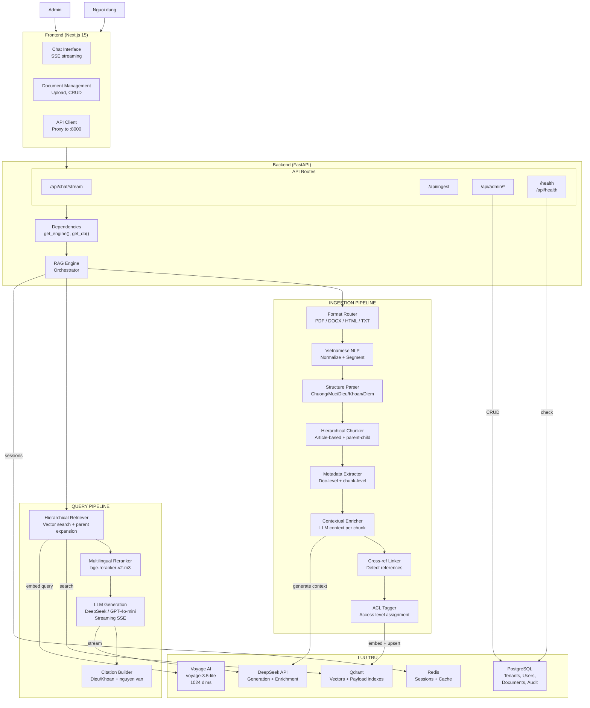
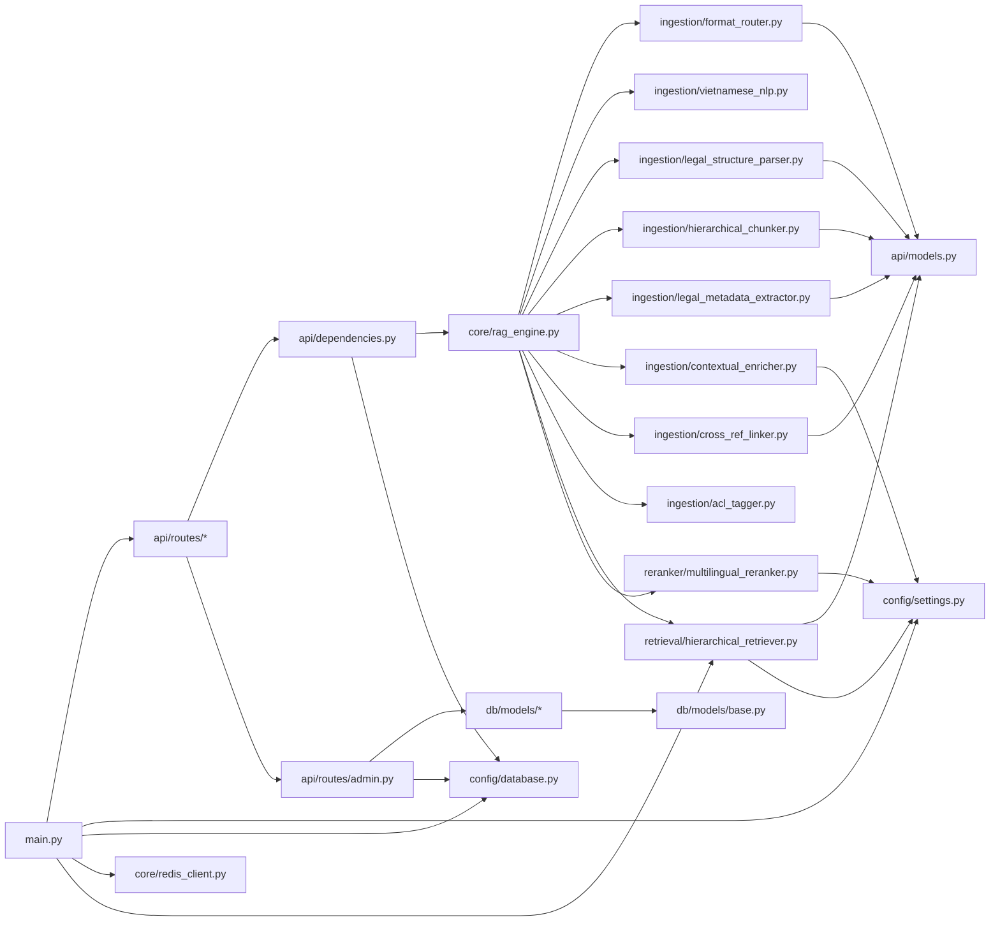

# Kien truc he thong

## Tong quan

He thong Legal Intelligence Platform gom 2 ung dung chinh:

- **Backend** (Python FastAPI): AI Engine xu ly ingestion, query, admin API
- **Frontend** (Next.js 15): Giao dien chat, quan ly tai lieu, dashboard

Backend giao tiep voi PostgreSQL (relational data), Qdrant (vector DB), Redis (cache/session), va LLM providers (DeepSeek / OpenAI).



## Cau truc thu muc

```
legal-rag/
├── .env.example                              # Bien moi truong template
├── .gitignore
├── Makefile                                  # Dev commands (make backend, make frontend, etc.)
├── docker-compose.yml                        # PostgreSQL + Qdrant + Redis
├── rag-optimization-proposal.md              # Blueprint goc
│
├── backend/
│   ├── pyproject.toml                        # Python dependencies
│   ├── Dockerfile
│   ├── alembic.ini                           # DB migration config
│   ├── alembic/
│   │   └── env.py                            # Async migration runner
│   ├── scripts/
│   │   ├── batch_ingest.py                   # Batch ingestion tool
│   │   └── download_samples.py               # Download sample docs
│   ├── eval/
│   │   ├── golden_test_set.yaml              # Golden test set (stub)
│   │   ├── metrics.py                        # Eval metrics (stub)
│   │   └── run_eval.py                       # Eval runner (stub)
│   └── src/
│       ├── main.py                           # FastAPI app, lifespan, CORS
│       ├── config/
│       │   ├── settings.py                   # Pydantic Settings (singleton)
│       │   └── database.py                   # SQLAlchemy async engine + session
│       ├── api/
│       │   ├── models.py                     # Enums, Pydantic models, schemas
│       │   ├── dependencies.py               # Singleton RAGEngine, DB session
│       │   └── routes/
│       │       ├── __init__.py               # Router aggregator
│       │       ├── chat.py                   # POST /api/chat/stream
│       │       ├── ingest.py                 # POST /api/ingest
│       │       ├── health.py                 # GET /health, GET /api/health
│       │       └── admin.py                  # CRUD /api/admin/*
│       ├── core/
│       │   ├── rag_engine.py                 # Orchestrator (ingest + query)
│       │   ├── redis_client.py               # Async Redis wrapper
│       │   ├── acl_filter.py                 # ACL filter builder (stub)
│       │   ├── citation_engine.py            # Citation engine (stub)
│       │   ├── contradiction_detector.py     # Contradiction detector (stub)
│       │   ├── cross_ref_resolver.py         # Cross-ref resolver (stub)
│       │   ├── faq_filter.py                 # FAQ filter (stub)
│       │   ├── model_router.py               # Model router (stub)
│       │   ├── query_rewriter.py             # Query rewriter (stub)
│       │   ├── semantic_cache.py             # Semantic cache (stub)
│       │   ├── suggestion_generator.py       # Suggestion generator (stub)
│       │   └── validity_filter.py            # Validity filter (stub)
│       ├── db/
│       │   └── models/
│       │       ├── __init__.py               # Export all models
│       │       ├── base.py                   # DeclarativeBase + mixins
│       │       ├── tenant.py                 # Tenant model
│       │       ├── user.py                   # User model
│       │       ├── document.py               # Document + DocumentRelationship
│       │       └── audit_log.py              # AuditLog model
│       ├── ingestion/
│       │   ├── format_router.py              # File type detection + parsing
│       │   ├── vietnamese_nlp.py             # Unicode normalize + word segment
│       │   ├── legal_structure_parser.py     # Hierarchy detection + tree build
│       │   ├── hierarchical_chunker.py       # Article-based chunking
│       │   ├── legal_metadata_extractor.py   # Doc/chunk metadata extraction
│       │   ├── contextual_enricher.py        # LLM context generation
│       │   ├── cross_ref_linker.py           # Legal reference regex extraction
│       │   └── acl_tagger.py                 # Default ACL rules
│       ├── retrieval/
│       │   ├── hierarchical_retriever.py     # Qdrant management + embedding + search
│       │   ├── bm25_keyword_retriever.py     # BM25 retriever (stub)
│       │   └── fusion.py                     # Rank fusion (stub)
│       └── reranker/
│           └── multilingual_reranker.py      # Cross-encoder reranker
│
├── frontend/
│   ├── package.json                          # Next.js 15, React 19, Tailwind
│   ├── Dockerfile
│   ├── next.config.ts                        # API proxy (/api/* -> :8000)
│   ├── tailwind.config.ts
│   ├── tsconfig.json
│   └── src/
│       ├── app/
│       │   ├── layout.tsx                    # Root layout + sidebar nav
│       │   ├── page.tsx                      # Home redirect
│       │   ├── globals.css                   # Tailwind base styles
│       │   ├── chat/
│       │   │   └── page.tsx                  # Chat page
│       │   └── admin/
│       │       └── documents/
│       │           └── page.tsx              # Document management page
│       ├── components/
│       │   ├── chat/
│       │   │   ├── chat-interface.tsx         # Full chat UI + streaming
│       │   │   ├── message-bubble.tsx         # Message render + metadata
│       │   │   └── citation-card.tsx          # Legal citation display
│       │   └── admin/
│       │       └── document-upload.tsx        # File upload component
│       ├── hooks/
│       │   └── use-chat.ts                   # Chat state + SSE consumption
│       └── lib/
│           ├── api-client.ts                 # API functions (stream, ingest, fetch)
│           └── types.ts                      # TypeScript interfaces
│
├── data/
│   └── samples/                              # Van ban mau de test
│
└── docs/                                     # Tai lieu ky thuat
```

## Module dependency graph



## External dependencies

| Service | Vai tro | Giao thuc |
|---------|---------|-----------|
| PostgreSQL | Relational DB: tenants, users, documents, audit logs | TCP :5432 |
| Qdrant | Vector DB, payload indexes, full-text index | HTTP :6333, gRPC :6334 |
| Redis | Session storage, cache (optional) | TCP :6379 |
| DeepSeek API | LLM generation, contextual enrichment | HTTPS (OpenAI-compatible) |
| Voyage AI | Text embedding (voyage-3.5-lite, 1024d) | HTTPS |
| OpenAI API | LLM fallback (gpt-4o-mini) | HTTPS |

## Quyet dinh thiet ke

**Tai sao tach thanh monorepo backend/ + frontend/?**
De cho phep frontend va backend develop/deploy doc lap. Frontend (Next.js) co the deploy len Vercel/CDN, backend (FastAPI) deploy len container rieng. API proxy trong `next.config.ts` giu giao tiep suot qua trinh development.

**Tai sao them PostgreSQL ben canh Qdrant?**
Qdrant luu tru vectors + payload cho search. PostgreSQL luu tru relational data (tenants, users, document CRUD, audit logs, relationships) ma khong phu hop luu trong vector DB. Day la nen tang cho multi-tenancy va admin features.

**Tai sao tach routes thanh nhieu files?**
`routes/chat.py`, `routes/ingest.py`, `routes/health.py`, `routes/admin.py` thay vi 1 file `routes.py`. Giup module hoa, de maintain, va cho phep them endpoints moi ma khong anh huong code cu.

**Tai sao dung Qdrant thay vi Pinecone/Weaviate?**
Qdrant ho tro payload indexes (keyword, integer, full-text) cho phep filter ACL va search BM25 truc tiep tren vector DB ma khong can them database rieng.

**Tai sao dung Voyage AI thay vi OpenAI embeddings?**
voyage-3.5-lite ho tro multilingual (bao gom tieng Viet) voi 1024 dimensions, chi phi thap hon, va co input_type parameter phan biet document vs query embedding.

**Tai sao dung DeepSeek lam LLM chinh?**
Chi phi thap (so voi GPT-4o), OpenAI-compatible API, ho tro tieng Viet tot. Fallback sang GPT-4o-mini khi DeepSeek khong kha dung.

**Tai sao Redis la optional?**
Phase 1 chua can semantic cache hay session persistence phuc tap. Client gui conversation_history truc tiep trong request body. Redis se bat buoc o Phase 3 khi trien khai multi-turn va semantic cache.
