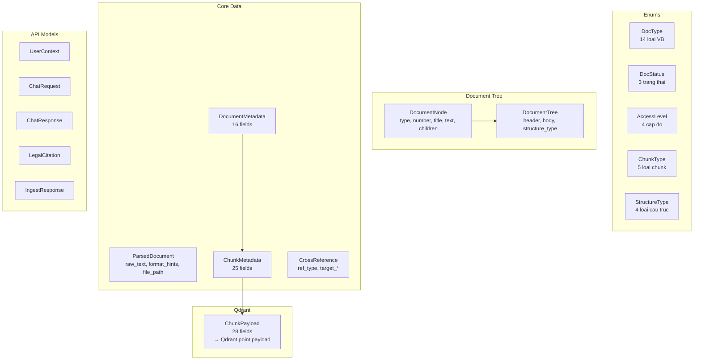
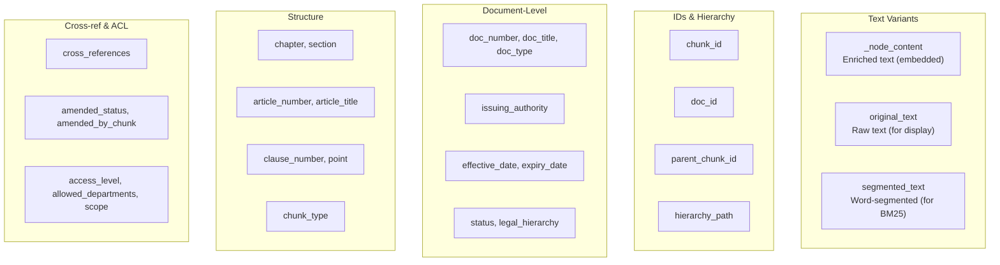
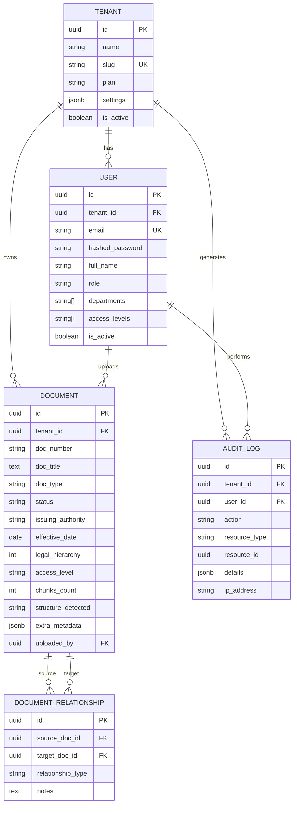

# Data Models

He thong su dung 2 loai models:

- **Pydantic models** (`backend/src/api/models.py`): Enums, request/response schemas, Qdrant payload
- **SQLAlchemy models** (`backend/src/db/models/`): PostgreSQL tables (tenants, users, documents, audit)

## Tong quan

---

## Enums

### DocType

Loai van ban phap ly.

| Gia tri | Mo ta | Legal Hierarchy |
|---------|-------|----------------|
| `luat` | Luat | 1 (cao nhat) |
| `nghi_dinh` | Nghi dinh | 2 |
| `thong_tu` | Thong tu | 3 |
| `quyet_dinh` | Quyet dinh | 4 |
| `noi_quy` | Noi quy noi bo | 5 |
| `quy_che` | Quy che | 5 |
| `quy_trinh` | Quy trinh | 5 |
| `hop_dong` | Hop dong | 5 |
| `bien_ban` | Bien ban | 5 |
| `nghi_quyet` | Nghi quyet | 5 |
| `cong_van` | Cong van | 5 |
| `thong_bao` | Thong bao | 5 |
| `chinh_sach` | Chinh sach | 5 |
| `khac` | Khac | 5 |

### DocStatus

Trang thai hieu luc cua van ban.

| Gia tri | Mo ta |
|---------|-------|
| `hieu_luc` | Con hieu luc (default) |
| `het_hieu_luc` | Da het hieu luc |
| `da_sua_doi` | Da bi sua doi, bo sung |

### AccessLevel

Cap do quyen truy cap.

| Gia tri | Mo ta |
|---------|-------|
| `public` | Cong khai toan cong ty |
| `internal` | Noi bo, gioi han department |
| `confidential` | Mat, chi dinh cu the |
| `restricted` | Han che, can phe duyet |

### ChunkType

Loai chunk sau khi tach.

| Gia tri | Mo ta |
|---------|-------|
| `article` | Toan bo 1 Dieu (hoac parent chunk) |
| `clause` | 1 Khoan trong Dieu |
| `point` | 1 Diem trong Khoan |
| `paragraph` | Doan van (unstructured) |
| `section` | Muc/Phan |

### StructureType

Loai cau truc van ban nhan dien duoc.

| Gia tri | Dieu kien nhan dien |
|---------|-------------------|
| `legal_standard` | Chuong >= 1 VA Dieu >= 2 |
| `numbered_articles` | Dieu >= 2 (khong co Chuong) |
| `sections` | Muc >= 2 HOAC Phan >= 2 |
| `unstructured` | Khong match dieu kien nao |

---

## Document Tree Models

### DocumentNode

Node trong cay cau truc van ban. Duoc tao boi `LegalStructureParser`.

| Field | Type | Mo ta |
|-------|------|-------|
| `type` | string | "phan", "chuong", "muc", "dieu", "khoan", "diem", "paragraph" |
| `number` | string? | So hieu: "II", "12", "1", "a" |
| `title` | string? | Tieu de (neu co): "Quy dinh chung" |
| `text` | string | Noi dung text cua node |
| `children` | list[DocumentNode] | Cac node con |

### DocumentTree

Ket qua output cua structure parser.

| Field | Type | Mo ta |
|-------|------|-------|
| `header` | dict | Metadata extract tu header VB |
| `body` | list[DocumentNode] | Cay cau truc noi dung |
| `structure_type` | StructureType | Loai cau truc nhan dien |

**Header dict fields:**

| Key | Vi du | Mo ta |
|-----|-------|-------|
| `doc_number` | "145/2020/ND-CP" | So hieu van ban |
| `date` | "2020-12-25" | Ngay ban hanh |
| `issuing_authority` | "CHINH PHU" | Co quan ban hanh |
| `title` | "NGHI DINH..." | Tieu de van ban |

---

## Core Data Models

### ParsedDocument

Output cua `FormatRouter`. Chua raw text va hints ve format.

| Field | Type | Default | Mo ta |
|-------|------|---------|-------|
| `raw_text` | string | -- | Text trich xuat tu file |
| `format_hints` | dict | `{}` | Hints: so_trang, headings, likely_scanned |
| `file_path` | string | `""` | Duong dan file goc |

### DocumentMetadata

Metadata cap van ban. Duoc tao boi `LegalMetadataExtractor`.

| Field | Type | Default | Mo ta |
|-------|------|---------|-------|
| `doc_id` | string | auto UUID | ID van ban |
| `doc_number` | string | `""` | So hieu: "NQ-HR-2025-001" |
| `doc_title` | string | `""` | Tieu de van ban |
| `doc_type` | string | `"khac"` | DocType enum value |
| `issuing_authority` | string | `""` | Co quan ban hanh |
| `issue_date` | date? | `None` | Ngay ban hanh |
| `effective_date` | date? | `None` | Ngay hieu luc |
| `expiry_date` | date? | `None` | Ngay het hieu luc |
| `status` | string | `"hieu_luc"` | DocStatus enum value |
| `scope` | list[string] | `["toan_cong_ty"]` | Pham vi ap dung |
| `replaces_doc` | string? | `None` | VB bi thay the |
| `amended_by` | list[string] | `[]` | Danh sach VB sua doi |
| `legal_hierarchy` | int | `5` | 1=Luat...5=Noi quy |
| `access_level` | string | `"public"` | AccessLevel value |
| `allowed_departments` | list[string] | `["all"]` | Department co quyen |
| `original_file_path` | string | `""` | Duong dan file goc |

### ChunkMetadata

Metadata cap chunk. Ket hop vi tri trong cau truc va metadata ke thua tu document.

| Field | Type | Default | Mo ta |
|-------|------|---------|-------|
| `chunk_id` | string | auto UUID | ID chunk |
| `doc_id` | string | `""` | ID van ban cha |
| `parent_chunk_id` | string? | `None` | ID parent chunk (khi Dieu bi tach) |
| `hierarchy_path` | string | `""` | "Chuong II > Dieu 12 > Khoan 1" |
| `chapter` | string? | `None` | So Chuong |
| `section` | string? | `None` | So Muc |
| `article_number` | string? | `None` | So Dieu |
| `article_title` | string? | `None` | Tieu de Dieu |
| `clause_number` | string? | `None` | So Khoan |
| `point` | string? | `None` | So Diem |
| `chunk_type` | string | `"paragraph"` | ChunkType value |
| `original_text` | string | `""` | Noi dung nguyen van |
| `cross_references` | list[string] | `[]` | Tham chieu cheo |
| `amended_status` | string | `"original"` | Tinh trang sua doi |
| `amended_by_chunk` | string? | `None` | Chunk sua doi |
| `doc_number` | string | `""` | (ke thua) So hieu VB |
| `doc_title` | string | `""` | (ke thua) Ten VB |
| `doc_type` | string | `""` | (ke thua) Loai VB |
| `effective_date` | string? | `None` | (ke thua) Ngay hieu luc |
| `status` | string | `"hieu_luc"` | (ke thua) Trang thai |
| `access_level` | string | `"public"` | (ke thua) Quyen truy cap |
| `allowed_departments` | list[string] | `["all"]` | (ke thua) Departments |
| `legal_hierarchy` | int | `5` | (ke thua) Thu bac phap ly |
| `issuing_authority` | string | `""` | (ke thua) Co quan ban hanh |
| `scope` | list[string] | `["toan_cong_ty"]` | (ke thua) Pham vi |

### CrossReference

Tham chieu cheo giua cac van ban/dieu khoan.

| Field | Type | Mo ta |
|-------|------|-------|
| `ref_type` | string | `"internal"` hoac `"external"` |
| `target_article` | string? | "Dieu 15" |
| `target_clause` | string? | "Khoan 3" |
| `target_doc` | string? | "ND-145/2020/ND-CP" |
| `raw_text` | string | Text match goc |

---

## Qdrant Payload Schema

### ChunkPayload

Map 1:1 voi payload cua moi point trong Qdrant. Day la single source of truth cho du lieu luu tru.

**Tong cong 28 fields** trong payload moi point.

### Payload Indexes

Indexes duoc tao tu dong khi `ensure_collection()` chay lan dau:

| Field | Index Type | Muc dich |
|-------|-----------|----------|
| `doc_number` | keyword | Filter theo so hieu VB |
| `doc_type` | keyword | Filter theo loai VB |
| `article_number` | keyword | Tim chinh xac theo Dieu |
| `status` | keyword | Filter theo hieu luc |
| `access_level` | keyword | ACL enforcement |
| `allowed_departments` | keyword | ACL enforcement |
| `effective_date` | keyword | Filter theo ngay |
| `amended_status` | keyword | Filter VB da sua doi |
| `scope` | keyword | Filter pham vi ap dung |
| `legal_hierarchy` | integer | Uu tien VB cap cao |
| `_node_content` | full-text (word tokenizer) | BM25 keyword search (Phase 2) |

### Methods

**`to_qdrant_payload() -> dict`**

Serialize ChunkPayload thanh dict de truyen vao Qdrant upsert. Xu ly private field `_node_content`.

**`from_chunk_metadata(chunk, enriched_text, segmented_text) -> ChunkPayload`**

Tao ChunkPayload tu ChunkMetadata + enriched/segmented text. Neu `enriched_text` rong, dung `original_text` lam `_node_content`.

---

## API Models

### ChatRequest

| Field | Type | Required | Default |
|-------|------|----------|---------|
| `question` | string | Yes | -- |
| `language` | string | No | `"vi"` |
| `conversation_id` | string? | No | `None` (auto UUID) |
| `conversation_history` | list[ChatMessage] | No | `[]` |
| `user_context` | UserContext? | No | `None` |

### UserContext

| Field | Type | Default |
|-------|------|---------|
| `user_id` | string | `"anonymous"` |
| `departments` | list[string] | `["all"]` |
| `access_levels` | list[string] | `["public"]` |
| `role` | string | `"nhan_vien"` |

### ChatMessage

| Field | Type |
|-------|------|
| `role` | string (`"user"` / `"assistant"`) |
| `content` | string |

### LegalCitation

| Field | Type | Default |
|-------|------|---------|
| `doc_title` | string | `""` |
| `doc_number` | string | `""` |
| `doc_type` | string | `""` |
| `article` | string? | `None` |
| `clause` | string? | `None` |
| `point` | string? | `None` |
| `hierarchy_path` | string | `""` |
| `exact_quote` | string | `""` |
| `issuing_authority` | string | `""` |
| `effective_date` | string? | `None` |
| `validity_status` | string | `"hieu_luc"` |
| `amended_status` | string | `"original"` |
| `groundedness_score` | float | `0.0` |
| `is_cross_reference` | bool | `False` |

### ConflictInfo

| Field | Type | Default |
|-------|------|---------|
| `topic` | string | `""` |
| `primary_source` | string | `""` |
| `conflicting_sources` | list[string] | `[]` |
| `resolution_reason` | string | `""` |

### ChatResponse

Non-streaming response model (dung cho reference, thuc te response qua SSE).

| Field | Type | Default |
|-------|------|---------|
| `answer` | string | `""` |
| `citations` | list[LegalCitation] | `[]` |
| `groundedness` | float | `0.0` |
| `confidence` | float | `0.0` |
| `sources_count` | int | `0` |
| `has_expired_sources` | bool | `False` |
| `has_conflicts` | bool | `False` |
| `conflict_details` | list[ConflictInfo]? | `None` |
| `validity_warnings` | list[string] | `[]` |
| `conversation_id` | string | `""` |

### IngestResponse

| Field | Type | Default |
|-------|------|---------|
| `success` | bool | `True` |
| `doc_id` | string | `""` |
| `chunks_created` | int | `0` |
| `structure_detected` | string | `""` |
| `articles_found` | int | `0` |
| `cross_references_found` | int | `0` |
| `warnings` | list[string] | `[]` |

---

## SQLAlchemy Models (PostgreSQL)

Relational data luu tru trong PostgreSQL. Tat ca models ke thua tu mixins chung:

**File:** `backend/src/db/models/base.py`

| Mixin | Fields | Mo ta |
|-------|--------|-------|
| `UUIDPrimaryKeyMixin` | `id` (UUID, auto) | Primary key UUID v4 |
| `TimestampMixin` | `created_at`, `updated_at` | Timestamp tu dong (server_default) |

### Tenant

**File:** `backend/src/db/models/tenant.py` — Goc cua multi-tenancy.

| Field | Type | Constraints | Mo ta |
|-------|------|-------------|-------|
| `id` | UUID | PK | ID tenant |
| `name` | string(255) | NOT NULL | Ten to chuc |
| `slug` | string(100) | UNIQUE, NOT NULL | URL-friendly identifier |
| `plan` | string(50) | default "free" | Goi: free, starter, pro, enterprise |
| `settings` | JSONB | nullable | Cau hinh rieng per tenant |
| `is_active` | bool | default true | Trang thai hoat dong |
| `created_at` | timestamp | auto | Ngay tao |
| `updated_at` | timestamp | auto | Ngay cap nhat |

**Relationships:** `users` (1:N), `documents` (1:N)

### User

**File:** `backend/src/db/models/user.py` — Nguoi dung va phan quyen.

| Field | Type | Constraints | Mo ta |
|-------|------|-------------|-------|
| `id` | UUID | PK | ID user |
| `tenant_id` | UUID | FK → tenants.id, indexed | Thuoc tenant nao |
| `email` | string(255) | UNIQUE, NOT NULL | Email dang nhap |
| `hashed_password` | string(255) | NOT NULL | Password hash (bcrypt) |
| `full_name` | string(255) | default "" | Ho ten |
| `role` | string(50) | default "viewer" | Vai tro: admin, editor, viewer |
| `departments` | ARRAY(string) | default [] | Phong ban: ["hr", "legal"] |
| `access_levels` | ARRAY(string) | default ["public"] | Cap do: ["public", "internal"] |
| `is_active` | bool | default true | Trang thai hoat dong |

**Relationships:** `tenant` (N:1)

### Document

**File:** `backend/src/db/models/document.py` — Metadata tai lieu (bo sung cho Qdrant payload).

| Field | Type | Constraints | Mo ta |
|-------|------|-------------|-------|
| `id` | UUID | PK | ID document |
| `tenant_id` | UUID | FK → tenants.id, indexed | Thuoc tenant nao |
| `doc_number` | string(100) | indexed | So hieu VB |
| `doc_title` | text | | Ten tai lieu |
| `doc_type` | string(50) | indexed, default "khac" | Loai VB (DocType) |
| `status` | string(50) | indexed, default "hieu_luc" | Trang thai hieu luc |
| `issuing_authority` | string(255) | | Co quan ban hanh |
| `issue_date` | date | nullable | Ngay ban hanh |
| `effective_date` | date | nullable | Ngay hieu luc |
| `expiry_date` | date | nullable | Ngay het hieu luc |
| `legal_hierarchy` | int | default 5 | Thu bac phap ly |
| `access_level` | string(50) | default "public" | Cap do truy cap |
| `allowed_departments` | ARRAY(string) | default ["all"] | Departments duoc phep |
| `scope` | ARRAY(string) | default ["toan_cong_ty"] | Pham vi ap dung |
| `original_file_path` | text | | Duong dan file goc |
| `chunks_count` | int | default 0 | So chunks da tao |
| `structure_detected` | string(50) | | Loai cau truc (StructureType) |
| `extra_metadata` | JSONB | nullable | Metadata bo sung |
| `uploaded_by` | UUID | FK → users.id, nullable | Nguoi upload |

**Relationships:** `tenant` (N:1), `source_relationships` (1:N), `target_relationships` (1:N)

### DocumentRelationship

**File:** `backend/src/db/models/document.py` — Quan he giua cac tai lieu.

| Field | Type | Constraints | Mo ta |
|-------|------|-------------|-------|
| `id` | UUID | PK | ID relationship |
| `source_doc_id` | UUID | FK → documents.id, indexed | VB nguon |
| `target_doc_id` | UUID | FK → documents.id, indexed | VB dich |
| `relationship_type` | string(50) | NOT NULL | Loai quan he |
| `notes` | text | default "" | Ghi chu |

**Cac loai `relationship_type`:**

| Gia tri | Mo ta |
|---------|-------|
| `sua_doi` | VB nguon sua doi VB dich |
| `thay_the` | VB nguon thay the VB dich |
| `huong_dan` | VB nguon huong dan thuc hien VB dich |
| `bai_bo` | VB nguon bai bo VB dich |
| `dan_chieu` | VB nguon dan chieu/tham chieu VB dich |

### AuditLog

**File:** `backend/src/db/models/audit_log.py` — Nhat ky thao tac cho compliance.

| Field | Type | Constraints | Mo ta |
|-------|------|-------------|-------|
| `id` | UUID | PK | ID log entry |
| `tenant_id` | UUID | FK → tenants.id, indexed | Thuoc tenant nao |
| `user_id` | UUID | FK → users.id, nullable, indexed | Nguoi thuc hien |
| `action` | string(50) | NOT NULL, indexed | Hanh dong: query, ingest, update, delete, login, export |
| `resource_type` | string(50) | NOT NULL | Loai resource: document, chat, contract, user |
| `resource_id` | UUID | nullable | ID resource lien quan |
| `details` | JSONB | nullable | Chi tiet (query text, changes, etc.) |
| `ip_address` | string(50) | default "" | IP nguoi dung |

### ER Diagram

### Dual storage: PostgreSQL vs Qdrant

| Data | PostgreSQL | Qdrant |
|------|-----------|--------|
| Document metadata (CRUD) | Document table | ChunkPayload (doc_* fields) |
| User/tenant/auth | User, Tenant tables | -- |
| Audit trail | AuditLog table | -- |
| Document relationships | DocumentRelationship table | cross_references field |
| Vector embeddings | -- | Point vectors (1024d) |
| Chunk text + structure | -- | ChunkPayload (28 fields) |
| Full-text search | -- | _node_content index |

PostgreSQL la system of record cho relational data. Qdrant la system of record cho vector search. Khi ingest, metadata duoc ghi vao ca 2 noi.
