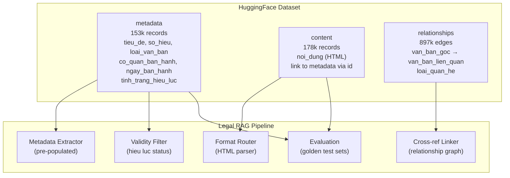
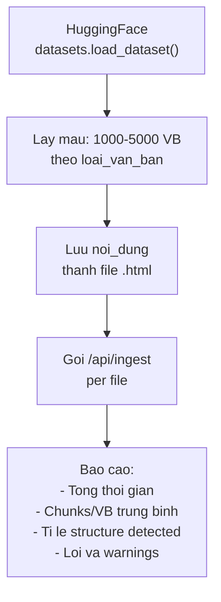
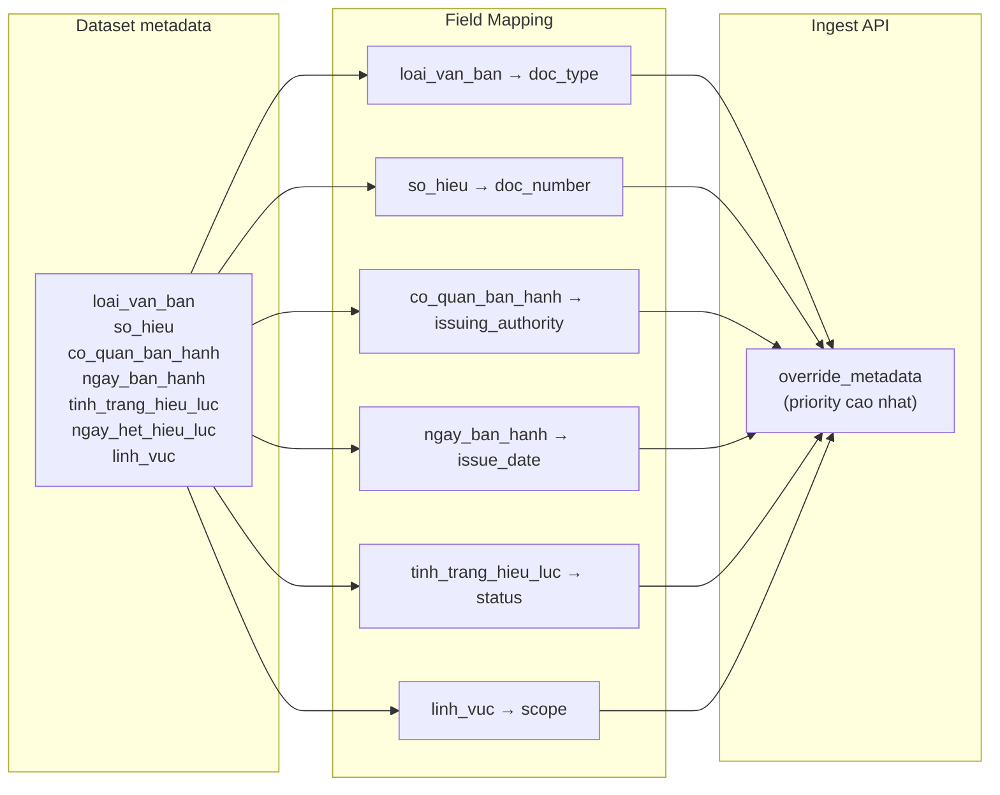
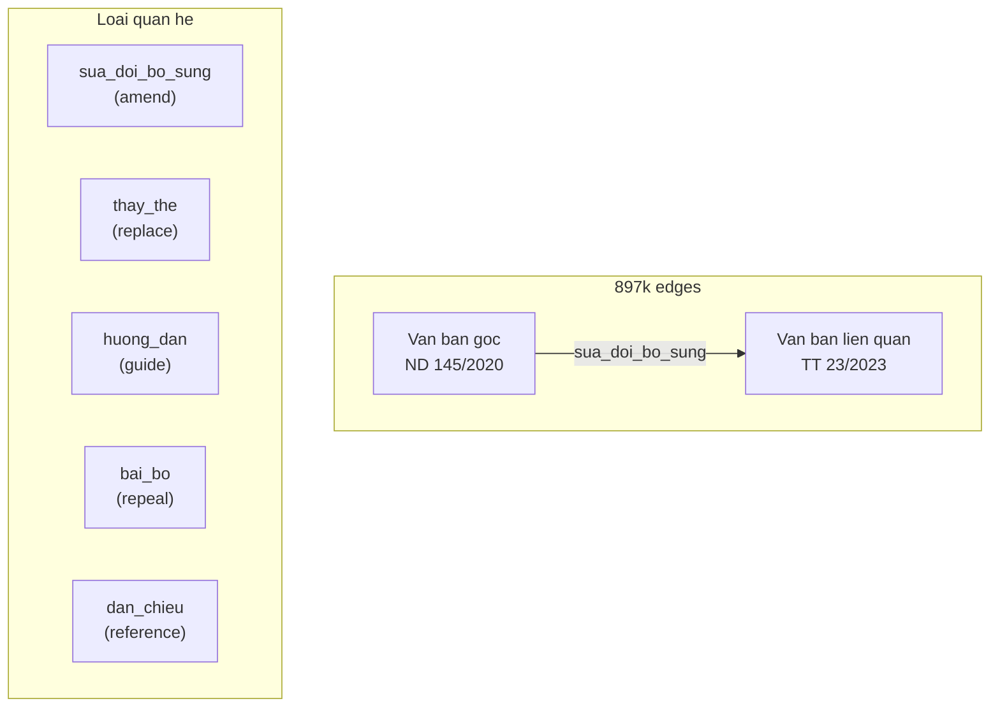
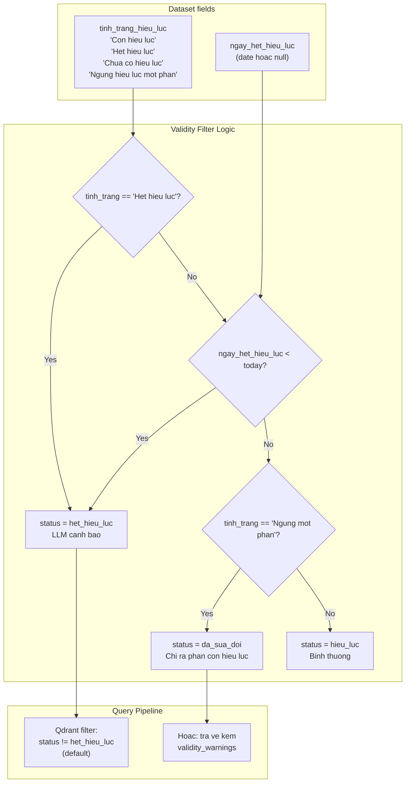
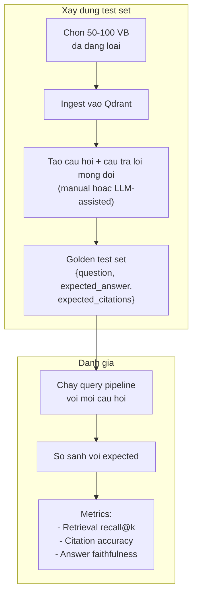

# Dataset Integration

Tich hop dataset [`th1nhng0/vietnamese-legal-documents`](https://huggingface.co/datasets/th1nhng0/vietnamese-legal-documents) tu HuggingFace de toi uu he thong RAG phap ly.

## Tong quan dataset

Dataset thu thap tu [vbpl.vn](https://vbpl.vn) (Co so du lieu quoc gia ve van ban phap luat), bao gom 3 tables:

| Table | So luong | Noi dung |
|-------|---------|---------|
| `metadata` | ~153,000 records | Thong tin VB: tieu de, so hieu, loai, co quan, ngay, hieu luc |
| `content` | ~178,000 records | Noi dung day du dang HTML |
| `relationships` | ~897,000 edges | Quan he giua cac VB (sua doi, bo sung, thay the, huong dan) |



---

## 5 Use Cases

### Use Case 1: Bulk Ingestion Testing

**Muc dich:** Test ingestion pipeline voi hang nghin van ban phap ly thuc te, phat hien edge cases va do performance.

**Cach thuc hien:**



**Data mapping:**

| Dataset field | Dung cho |
|--------------|---------|
| `noi_dung` (HTML) | File input cho format_router |
| `loai_van_ban` | Chon mau da dang: Luat, ND, TT, QD... |
| `so_hieu` | Verify metadata extraction accuracy |

**Metrics can do:**

| Metric | Mo ta |
|--------|-------|
| Throughput | VB/phut, chunks/phut |
| Structure accuracy | % VB duoc phat hien dung structure type |
| Chunk distribution | Trung binh chunks per Dieu, parent-child ratio |
| Error rate | % VB loi khi ingest |
| Memory | Peak memory khi xu ly VB dai |

**Vi du script:**

```python
from datasets import load_dataset

ds = load_dataset("th1nhng0/vietnamese-legal-documents", "metadata")
content_ds = load_dataset("th1nhng0/vietnamese-legal-documents", "content")

# Lay 1000 VB loai "Nghi dinh"
nghi_dinhs = [r for r in ds["train"] if r["loai_van_ban"] == "Nghi dinh"][:1000]

for doc in nghi_dinhs:
    doc_id = doc["id"]
    content = content_ds["train"].filter(lambda x: x["id"] == doc_id)
    html = content[0]["noi_dung"]
    
    # Save as HTML file
    with open(f"/tmp/{doc_id}.html", "w") as f:
        f.write(html)
    
    # Call ingest API
    # ...
```

---

### Use Case 2: Pre-populated Metadata

**Muc dich:** Su dung metadata co san tu dataset lam ground truth thay vi phu thuoc hoan toan vao auto-detection cua `LegalMetadataExtractor`.

**Van de hien tai:**

Auto-detection dua vao regex de nhan dien `doc_type`, `doc_number`, `issuing_authority` tu header van ban. Do chinh xac ~70-80% o lan dau.

**Giai phap:**

Dataset cung cap metadata da co san tu vbpl.vn -- chinh xac 100% vi la du lieu goc.



**Field mapping chi tiet:**

| Dataset field | RAG field | Transform |
|--------------|-----------|-----------|
| `loai_van_ban` | `doc_type` | "Nghi dinh" → `nghi_dinh`, "Thong tu" → `thong_tu` |
| `so_hieu` | `doc_number` | Direct mapping |
| `co_quan_ban_hanh` | `issuing_authority` | Direct mapping |
| `ngay_ban_hanh` | `issue_date` | Parse date string |
| `ngay_co_hieu_luc` | `effective_date` | Parse date string |
| `ngay_het_hieu_luc` | `expiry_date` | Parse date string |
| `tinh_trang_hieu_luc` | `status` | "Con hieu luc" → `hieu_luc`, "Het hieu luc" → `het_hieu_luc` |
| `linh_vuc` | `scope` | Split comma-separated → list |

**Loi ich:**
- Metadata chinh xac 100% cho moi VB
- Khong can tuy chinh regex cho tung loai VB
- Co the so sanh ket qua auto-detect voi ground truth de cai thien extractor

---

### Use Case 3: Cross-Reference Graph

**Muc dich:** Xay dung do thi tham chieu cheo giua cac van ban tu 897k relationship edges, phuc vu cho `cross_ref_resolver.py` (Phase 2).

**Du lieu relationships:**



**Cach ung dung:**

| Loai quan he | Ung dung trong RAG |
|-------------|-------------------|
| `sua_doi_bo_sung` | Set `amended_status` = "amended", link `amended_by` |
| `thay_the` | Set VB cu `status` = "het_hieu_luc", `replaces_doc` tro ve VB moi |
| `bai_bo` | Set VB bi bai bo `status` = "het_hieu_luc" |
| `huong_dan` | Them vao `cross_references` de LLM trich dan VB huong dan |
| `dan_chieu` | Them vao `cross_references` |

**Giai phap Phase 2:**

1. Load relationships table tu HuggingFace
2. Build graph (networkx hoac adjacency list) voi `van_ban_goc` → `van_ban_lien_quan`
3. Khi ingest VB moi, tra cuu graph de:
   - Tu dong set `amended_status`, `replaces_doc`
   - Tu dong populate `cross_references` voi VB lien quan
4. Khi query, neu LLM trich dan VB co relationships:
   - Fetch VB lien quan tu Qdrant
   - Them vao context de LLM tong hop

**Vi du graph query:**

```python
# Tim tat ca VB sua doi ND 145/2020
amended_docs = graph.successors("ND-145/2020", edge_type="sua_doi_bo_sung")

# Tim VB thay the
replaced_by = graph.successors("ND-145/2020", edge_type="thay_the")

# Tim VB huong dan
guides = graph.successors("ND-145/2020", edge_type="huong_dan")
```

---

### Use Case 4: Validity Filter

**Muc dich:** Su dung `tinh_trang_hieu_luc` va `ngay_het_hieu_luc` tu dataset de cap nhat trang thai hieu luc cua VB trong Qdrant, phuc vu `validity_filter.py` (Phase 2).

**Van de:**

Van ban phap ly thay doi trang thai theo thoi gian. VB het hieu luc van co the co trong Qdrant nhung can duoc canh bao hoac loai tru khi tra loi.



**Hai chien luoc:**

| Chien luoc | Mo ta | Khi nao |
|-----------|-------|---------|
| **Filter** | Loai bo VB het hieu luc khoi search results | Default: nguoi dung muon VB con hieu luc |
| **Warn** | Van tra ve nhung kem canh bao | Khi nguoi dung hoi ve lich su hoac VB cu |

**Implementation:**

```python
# Khi ingest tu dataset, set status chinh xac
override_metadata = {
    "status": map_validity(record["tinh_trang_hieu_luc"]),
    "expiry_date": record.get("ngay_het_hieu_luc"),
}

# Khi query, default filter het hieu luc
validity_condition = FieldCondition(
    key="status",
    match=MatchValue(value="hieu_luc"),
)
```

**Batch update:**

Dataset co the duoc dung de batch-update trang thai cua VB da co trong Qdrant:

1. Load metadata table
2. Voi moi VB co `tinh_trang_hieu_luc` = "Het hieu luc":
   - Tim chunks trong Qdrant theo `doc_number`
   - Update payload: `status` = "het_hieu_luc"

---

### Use Case 5: Evaluation & Golden Test Sets

**Muc dich:** Xay dung bo test vang (golden test sets) tu van ban thuc de danh gia chat luong retrieval va generation.

**Cach thuc hien:**



**3 loai test:**

#### Test Retrieval

| Metric | Mo ta | Cach do |
|--------|-------|--------|
| Recall@5 | % cau hoi co chunk dung trong top 5 | So sanh expected article voi reranked chunks |
| Recall@20 | % cau hoi co chunk dung trong top 20 | So sanh expected article voi raw retrieved chunks |
| MRR | Mean Reciprocal Rank | Vi tri chunk dung trong ranked list |

Vi du test case:

```json
{
  "question": "Thoi gian thu viec toi da doi voi hop dong lao dong tu 1-3 nam?",
  "expected_doc": "Bo luat Lao dong 2019",
  "expected_article": "Dieu 25",
  "expected_clause": "Khoan 1 Diem b"
}
```

#### Test Citation Accuracy

| Metric | Mo ta |
|--------|-------|
| Citation precision | % citations trong response tham chieu dung Dieu/Khoan |
| Citation recall | % Dieu/Khoan can thiet xuat hien trong citations |
| Exact match | Nguyen van trich dan khop voi original text |

#### Test Answer Faithfulness

| Metric | Mo ta |
|--------|-------|
| Groundedness | % noi dung tra loi co the trace ve nguon |
| Hallucination rate | % noi dung khong co trong context |
| Refusal accuracy | % cau hoi ngoai pham vi duoc tu choi dung |

**Dataset giup gi:**

1. **Da dang loai VB:** 153k records bao phu Luat, ND, TT, QD -- dam bao test across doc types
2. **Metadata chinh xac:** So hieu, Dieu, Khoan chinh xac tu vbpl.vn → verify citation
3. **Cross-references:** Relationships table giup tao cau hoi can nhieu nguon
4. **Hieu luc:** Test case voi VB het hieu luc de verify warning behavior

**Vi du evaluation script:**

```python
golden_tests = [
    {
        "question": "Nghi phep nam cho NV chinh thuc?",
        "expected_articles": ["Dieu 12"],
        "expected_doc": "NQ-HR-2025-001",
    },
    {
        "question": "Thu tuc xin nghi khong luong?",
        "expected_articles": ["Dieu 15"],
        "expected_doc": "NQ-HR-2025-001",
    },
]

for test in golden_tests:
    response = query_pipeline(test["question"])
    retrieved_articles = [c["article_number"] for c in response.chunks]
    
    recall = len(set(test["expected_articles"]) & set(retrieved_articles)) \
             / len(test["expected_articles"])
    print(f"Q: {test['question']} | Recall: {recall}")
```

---

## Ghi chu trien khai

| Use case | Phase | Trang thai |
|----------|-------|-----------|
| 1. Bulk ingestion testing | 1 | Co the bat dau ngay |
| 2. Pre-populated metadata | 1 | Co the bat dau ngay (qua override_metadata) |
| 3. Cross-reference graph | 2 | Can `cross_ref_resolver.py` |
| 4. Validity filter | 2 | Can `validity_filter.py` |
| 5. Evaluation | 1-2 | Bat dau xay dung golden set o Phase 1, danh gia day du o Phase 2 |

**Cai dat dataset:**

```bash
pip install datasets

# Trong Python
from datasets import load_dataset

# Load tung table
metadata = load_dataset("th1nhng0/vietnamese-legal-documents", "metadata")
content = load_dataset("th1nhng0/vietnamese-legal-documents", "content")
relationships = load_dataset("th1nhng0/vietnamese-legal-documents", "relationships")
```
