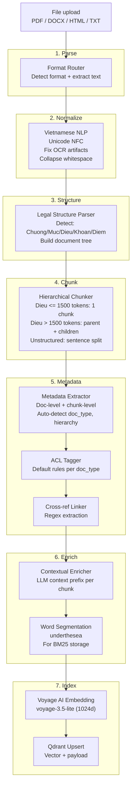
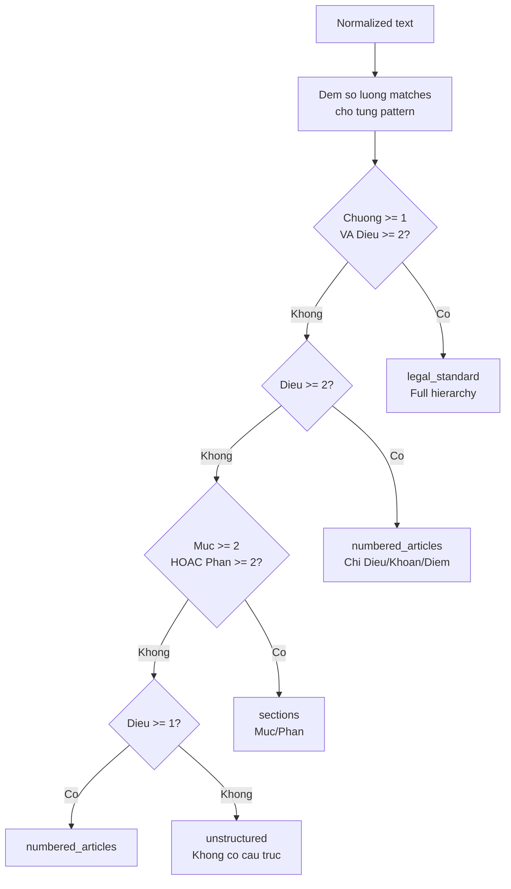
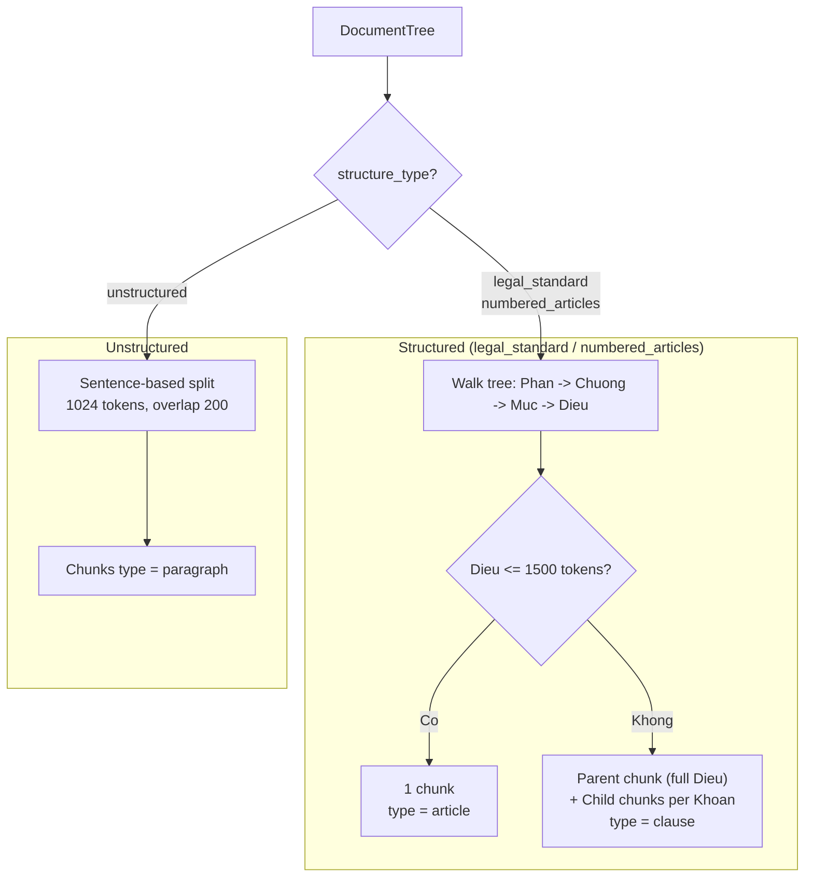

# Ingestion Pipeline

Bien van ban tho (PDF, DOCX, HTML) thanh vector chunks co cau truc, metadata, va lien ket tham chieu, luu vao Qdrant.

## Tong quan flow



## Chi tiet tung stage

### 1. Format Router

**File:** `backend/src/ingestion/format_router.py`

Nhan file, detect format, goi parser phu hop.

| Format | Library | Chi tiet |
|--------|---------|---------|
| PDF (text-based) | PyMuPDF (fitz) | Extract text per page. Canh bao neu < 100 ky tu (likely scanned) |
| DOCX | python-docx | Giu heading styles (`[H1]`, `[H2]`), centered text (`[CENTER]`), tables (`[TABLE]`) |
| HTML | BeautifulSoup + lxml | Strip scripts/styles/nav. Map h1-h6 sang `[Hn]`, li sang `- ` |
| Plain text | native | Doc truc tiep |

**Output:** `ParsedDocument(raw_text, format_hints, file_path)`

`format_hints` chua thong tin phu: so trang, headings detected, tables found, likely_scanned.

### 2. Vietnamese NLP Preprocessor

**File:** `backend/src/ingestion/vietnamese_nlp.py`

Hai chuc nang doc lap:

**`normalize(text)`** -- chay TRUOC structure parser:
- Unicode NFC normalization (quan trong cho dau tieng Viet)
- Fix loi OCR phap ly thuong gap: `Dieu` -> `Dieu`, `Khoan` -> `Khoan`
- Fix ky tu bi tach: `D i e u` -> `Dieu`
- Xoa NBSP, zero-width space, BOM
- Collapse whitespace, gioi han newline lien tiep <= 2

**`segment_words(text)`** -- chay SAU chunking:
- Dung `underthesea.word_tokenize(text, format="text")`
- Ghep tu ghep bang underscore: "nghi phep" -> "nghi_phep"
- Muc dich: tang do chinh xac BM25 (TF-IDF tren tu ghep thay vi tung tu don)

### 3. Legal Structure Parser

**File:** `backend/src/ingestion/legal_structure_parser.py`

Module phuc tap nhat. Nhan dien cau truc phan cap cua van ban phap ly tieng Viet.

**Hierarchy ho tro:**
```
Phan (Part) > Chuong (Chapter) > Muc (Section) > Dieu (Article) > Khoan (Clause) > Diem (Point)
```

**Phat hien cau truc:**



**Regex patterns:**

| Element | Pattern | Vi du match |
|---------|---------|-------------|
| Phan | `(?:PHAN\|Phan)\s+(?:thu\s+)?([IVXLCDM]+\|\d+)` | "PHAN thu II" |
| Chuong | `(?:CHUONG\|Chuong)\s+([IVXLCDM]+\|\d+)` | "CHUONG I. Quy dinh chung" |
| Muc | `(?:MUC\|Muc)\s+(\d+)` | "Muc 3. An toan lao dong" |
| Dieu | `(?:DIEU\|Dieu)\s+(\d+)` | "Dieu 12. Nghi phep nam" |
| Khoan | `^\s*(\d+)\.\s+` (chi trong Dieu) | "1. Nhan vien chinh thuc..." |
| Diem | `^\s*([a-zd])\)\s+` (chi trong Khoan) | "a) Ap dung cho con ruot" |

**Luu y:** Khoan va Diem chi duoc match trong scope cua Dieu/Khoan tuong ung de tranh false positives.

**Header extraction:**
- So hieu VB: regex cho `NQ-XX-YYYY-NNN`, `145/2020/ND-CP`, `23/2023/TT-BTC`
- Ngay: `ngay DD thang MM nam YYYY` hoac `DD/MM/YYYY`
- Co quan ban hanh: `BO...`, `UY BAN...`, `QUOC HOI`
- Tieu de: dong all-caps hoac bat dau bang "Noi quy", "Nghi dinh"...

**Output:** `DocumentTree(header, body, structure_type)`

### 4. Hierarchical Chunker

**File:** `backend/src/ingestion/hierarchical_chunker.py`

Chunk document tree thanh danh sach `ChunkMetadata` voi quan he parent-child.

**Strategy:**



**Parent-child relationship:**

Khi 1 Dieu duoc tach thanh nhieu chunks:
- Parent chunk: toan bo text cua Dieu, `chunk_type = article`
- Child chunks: moi Khoan la 1 chunk, `chunk_type = clause`, `parent_chunk_id = parent.chunk_id`
- Child chunk co context prefix: ten Dieu + tieu de de doc lap duoc

**Token estimation:** ~1 token / 3.5 ky tu tieng Viet (heuristic).

**hierarchy_path:** Breadcrumb nhu "Chuong II > Dieu 12 > Khoan 1"

### 5. Metadata Extraction + ACL + Cross-references

**Metadata Extractor** (`backend/src/ingestion/legal_metadata_extractor.py`):
- Auto-detect `doc_type` tu title keywords hoac doc_number prefix
- Map `doc_type` sang `legal_hierarchy` (1=Luat, 2=ND, 3=TT, 4=QD, 5=Noi quy)
- Admin override co uu tien cao nhat
- Copy doc-level fields xuong tung chunk

**ACL Tagger** (`backend/src/ingestion/acl_tagger.py`):

| doc_type | access_level | allowed_departments |
|----------|-------------|-------------------|
| luat, nghi_dinh, thong_tu, noi_quy | public | all |
| quy_che, quy_trinh | internal | all (hoac admin chi dinh) |
| hop_dong, bien_ban | confidential | (admin chi dinh) |
| nghi_quyet | restricted | (admin chi dinh) |

**Cross-ref Linker** (`backend/src/ingestion/cross_ref_linker.py`):

Regex extraction, Phase 1 chi luu reference strings, chua build graph.

| Loai | Pattern | Vi du |
|------|---------|-------|
| Internal | `tai Dieu X (Khoan Y) cua Noi quy nay` | ref_type=internal, target_article=Dieu 15 |
| External (ND) | `Nghi dinh 145/2020/ND-CP` | ref_type=external, target_doc=... |
| External (TT) | `Thong tu 23/2023/TT-BTC` | ref_type=external, target_doc=... |
| External (noi bo) | `NQ-HR-2025-001` | ref_type=external, target_doc=... |

### 6. Contextual Enrichment + Word Segmentation

**Contextual Enricher** (`backend/src/ingestion/contextual_enricher.py`):

Goi LLM (DeepSeek) sinh 1-2 cau context cho moi chunk truoc khi embedding.

```
Input chunk:  "Nhan vien chinh thuc duoc nghi phep nam 12 ngay..."
Output:       "[Context: Noi quy lao dong 2025 (NQ-HR-2025-001), 
               Chuong II, Dieu 12 Khoan 1 -- quy dinh so ngay 
               nghi phep nam cho nhan vien chinh thuc.]

               Nhan vien chinh thuc duoc nghi phep nam 12 ngay..."
```

- Concurrency: `asyncio.Semaphore(5)` de khong vuot rate limit
- Skip chunks < 50 ky tu
- Co the tat bang `SKIP_ENRICHMENT=true` trong .env
- Fallback: neu LLM loi, dung original text

**Word Segmentation:** Chay `underthesea.word_tokenize` tren original text de tao `segmented_text` luu vao Qdrant cho BM25 search (Phase 2).

### 7. Embedding + Indexing

**Embedding:** Voyage AI `voyage-3.5-lite` (1024 dims)
- `input_type="document"` khi index
- Batch 128 texts / request
- Text duoc embed: enriched text (co context prefix)

**Qdrant upsert:** Moi chunk thanh 1 point voi:
- `id`: chunk_id (UUID)
- `vector`: 1024-dim embedding
- `payload`: 28 fields (xem chi tiet tai [Data Models](./data-models.md))

**Payload indexes** duoc tao khi khoi tao collection:

| Field | Index type | Muc dich |
|-------|-----------|----------|
| doc_number, doc_type, article_number, status | keyword | Filter chinh xac |
| access_level, allowed_departments | keyword | ACL filter |
| effective_date, amended_status, scope | keyword | Validity filter |
| legal_hierarchy | integer | Uu tien VB cap cao |
| _node_content | full-text (word tokenizer) | BM25 search (Phase 2) |
