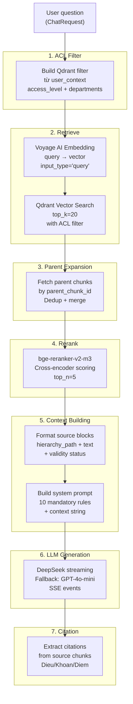
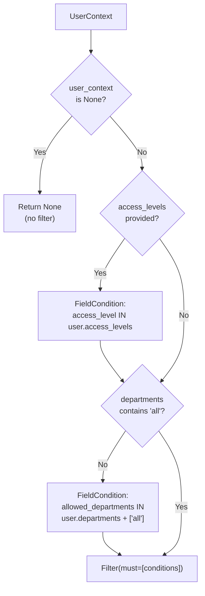
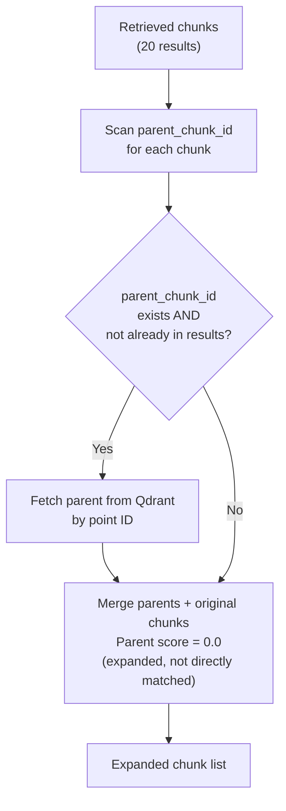
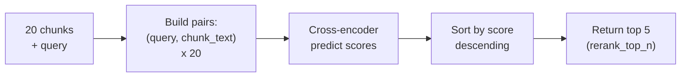
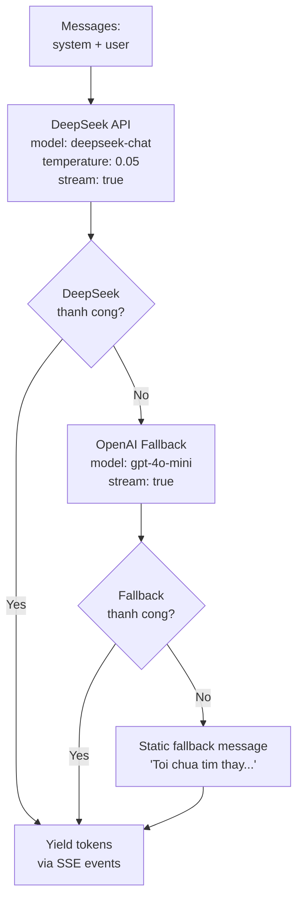
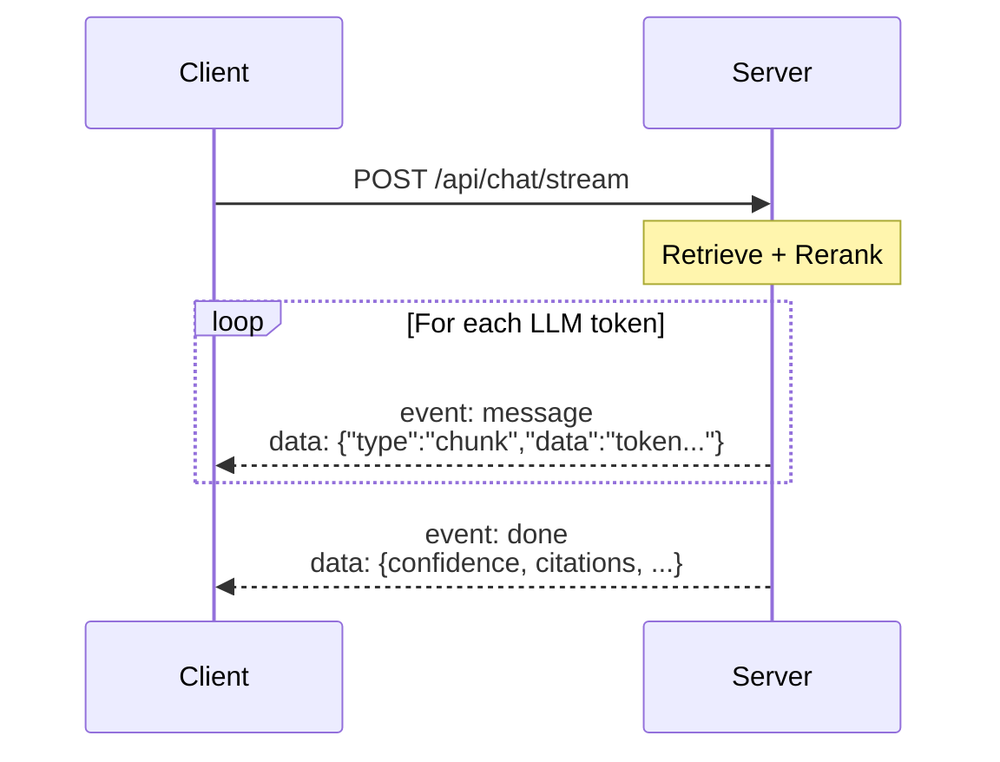

# Query Pipeline

Nhan cau hoi tu nguoi dung, tim kiem van ban lien quan trong Qdrant, rerank, sinh cau tra loi co trich dan chinh xac qua LLM streaming.

## Tong quan flow



## Chi tiet tung stage

### 1. ACL Filter Construction

**File:** `backend/src/core/rag_engine.py` (function `_build_acl_filter`)

Xay dung Qdrant filter tu `UserContext` de dam bao nguoi dung chi truy cap duoc tai lieu co quyen.

**Logic:**



| User field | Qdrant condition | Mo ta |
|-----------|-----------------|-------|
| `access_levels` | `MatchAny` on `access_level` | Chi tra ve chunks co access_level nam trong danh sach |
| `departments` | `MatchAny` on `allowed_departments` | Chi tra ve chunks cho phep department cua user; "all" luon duoc phep |

Neu khong co `user_context`, khong ap filter (Phase 1 default).

### 2. Vector Retrieval

**File:** `backend/src/retrieval/hierarchical_retriever.py` (class `HierarchicalRetriever`)

**Buoc 2a: Embed query**

Dung Voyage AI voi `input_type="query"` (khac voi `"document"` khi index). Day la asymmetric embedding -- query va document duoc encode khac nhau de tang chinh xac retrieval.

**Buoc 2b: Qdrant search**

```python
results = await client.search(
    collection_name="legal_chunks",
    query_vector=query_vector,
    limit=20,                    # retrieval_top_k
    query_filter=acl_filter,     # from Stage 1
    with_payload=True,
)
```

Moi ket qua tra ve:
- `payload`: toan bo metadata cua chunk (28 fields)
- `score`: cosine similarity (0.0 - 1.0)

**So luong:** Top 20 chunks duoc lay ra de dam bao recall cao truoc khi rerank loc xuong 5.

### 3. Parent Document Expansion

**File:** `backend/src/retrieval/hierarchical_retriever.py` (method `expand_parents`)

Khi mot Dieu dai duoc tach thanh nhieu Khoan (child chunks), search co the chi match 1 Khoan. Parent expansion fetch toan bo Dieu (parent chunk) de cung cap context day du.

**Logic:**



Parent chunks co `_score = 0.0` vi chung duoc lay tu expansion, khong phai tu vector search truc tiep. Reranker se danh gia lai relevance cua chung.

### 4. Cross-Encoder Reranking

**File:** `backend/src/reranker/multilingual_reranker.py`

**Model:** `BAAI/bge-reranker-v2-m3` -- cross-encoder da ngon ngu, ho tro tieng Viet.

**Cach hoat dong:**

Cross-encoder khac bi-encoder (Voyage AI) o cho:
- Bi-encoder: encode query va document doc lap, so sanh bang cosine → nhanh nhung thieu chinh xac
- Cross-encoder: encode (query, document) CUNG nhau → chinh xac hon nhung cham hon

Vi vay dung 2 buoc: bi-encoder lay 20 candidates nhanh, cross-encoder rerank 20 → chon 5 tot nhat.



**Fallback:** Neu model load that bai (thieu torch/GPU), reranker tra ve top-N theo cosine score goc. He thong van hoat dong nhung kem chinh xac hon.

**Lazy loading:** Model (~560MB) chi duoc tai khi co request dau tien, khong tai khi khoi dong server.

### 5. Context Building

**File:** `backend/src/core/rag_engine.py` (functions `_build_context_string`, `SYSTEM_PROMPT_VI`)

**Context string format:**

Moi chunk duoc format thanh 1 source block:

```
--- Nguon 1 ---
Van ban: Noi quy lao dong 2025 (NQ-HR-2025-001)
Vi tri: Chuong II > Dieu 12 > Khoan 1
Hieu luc: Con hieu luc

Nhan vien chinh thuc duoc nghi phep nam 12 ngay lam viec...
---
```

Cac fields duoc su dung:
| Field | Muc dich |
|-------|---------|
| `doc_title`, `doc_number` | Dinh danh van ban |
| `hierarchy_path` | Vi tri chinh xac trong van ban |
| `status` | Canh bao neu het hieu luc |
| `original_text` | Noi dung nguyen van |

**System prompt:**

10 quy tac bat buoc cho LLM:

| # | Quy tac | Muc dich |
|---|---------|---------|
| 1 | Chi tra loi dua tren Context | Chong hallucination |
| 2 | Trich dan chinh xac: ten VB, so hieu, Dieu/Khoan | Citation fidelity |
| 3 | Nguyen van trong ngoac kep | Verifiable quotes |
| 4 | Khong suy dien ngoai pham vi | Legal accuracy |
| 5 | Thong bao khi khong du thong tin | Honest uncertainty |
| 6 | Canh bao VB het hieu luc | Validity awareness |
| 7 | Trinh bay ca 2 khi mau thuan | Conflict transparency |
| 8 | Trich dan noi dung tham chieu | Cross-reference support |
| 9 | Van phong chinh xac, suc tich | Professional tone |
| 10 | Markdown formatting | Readability |

### 6. LLM Generation (Streaming)

**File:** `backend/src/core/rag_engine.py` (method `_stream_llm`)

**Primary:** DeepSeek API (OpenAI-compatible)
**Fallback:** GPT-4o-mini (OpenAI)



**Temperature:** 0.05 -- rat thap de dam bao output nhat quan, chinh xac cho van ban phap ly.

**3-tier fallback:**
1. DeepSeek (chi phi thap, ho tro tieng Viet)
2. GPT-4o-mini (chi khi DeepSeek loi)
3. Static message (chi khi ca 2 LLM deu loi)

### 7. Citation Building

**File:** `backend/src/core/rag_engine.py` (function `_build_citations`)

Sau khi LLM sinh xong cau tra loi, he thong trich xuat citations tu metadata cua cac source chunks.

**Moi citation bao gom:**

| Field | Vi du | Mo ta |
|-------|-------|-------|
| `doc_title` | "Noi quy lao dong 2025" | Ten van ban |
| `doc_number` | "NQ-HR-2025-001" | So hieu |
| `doc_type` | "noi_quy" | Loai van ban |
| `article` | "Dieu 12" | So dieu |
| `clause` | "Khoan 1" | So khoan |
| `point` | "Diem a" | So diem |
| `hierarchy_path` | "Chuong II > Dieu 12" | Breadcrumb |
| `exact_quote` | "Nhan vien chinh thuc..." | 500 ky tu dau |
| `issuing_authority` | "Ban Giam doc" | Co quan ban hanh |
| `effective_date` | "2025-01-01" | Ngay hieu luc |
| `validity_status` | "hieu_luc" | Trang thai |
| `amended_status` | "original" | Tinh trang sua doi |

**Dedup logic:** Citations duoc deduplicate theo `(doc_number, article_number, clause_number)` de tranh lap khi nhieu chunks cung thuoc 1 Dieu.

## SSE Event Flow

Client nhan events theo thu tu:



| Event type | Payload | Khi nao |
|-----------|---------|---------|
| `message` (default) | `{"type": "chunk", "data": "..."}` | Moi token tu LLM |
| `done` | `{confidence, citations, sources_count, ...}` | Ket thuc response |
| `error` | `{"error": "..."}` | Khi co loi pipeline |

**Done event payload:**

```json
{
  "confidence": 85.5,
  "groundedness": 0.0,
  "sources_count": 5,
  "citations": [...],
  "has_expired_sources": false,
  "has_conflicts": false,
  "validity_warnings": [],
  "conversation_id": "uuid-..."
}
```

## Phase 2+ Enhancements

| Module | Mo ta | Phase |
|--------|-------|-------|
| Query Rewriter | Multi-turn context rewriting | 3 |
| FAQ Filter | Match curated FAQ truoc khi search | 3 |
| Semantic Cache | Cache tra loi tuong tu (Redis) | 3 |
| Model Router | Route simple/complex queries | 3 |
| BM25 Hybrid Search | Keyword search ket hop vector | 2 |
| Rank Fusion | Merge BM25 + vector scores | 2 |
| Validity Filter | Loc VB het hieu luc | 2 |
| Contradiction Detector | Phat hien mau thuan giua VB | 3 |
| Citation Engine | Groundedness scoring, cross-ref resolution | 2 |
