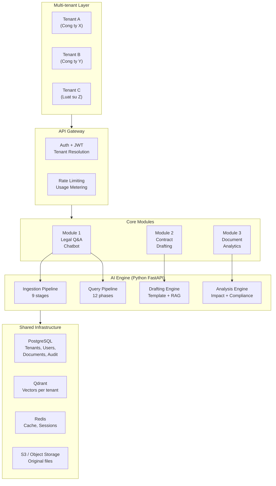
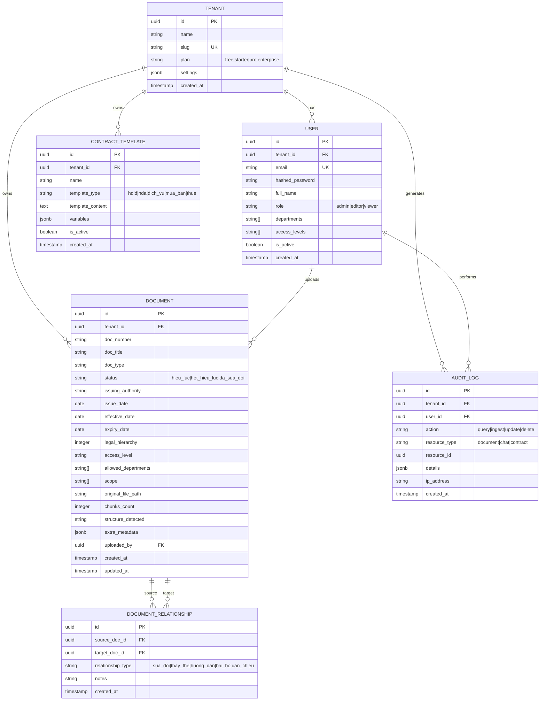
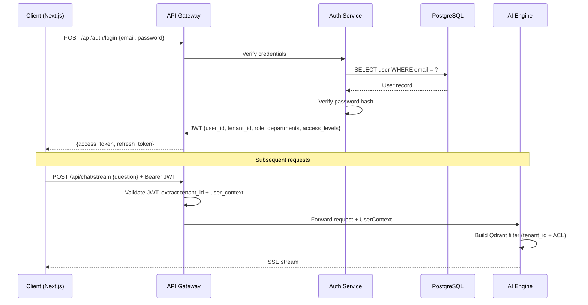
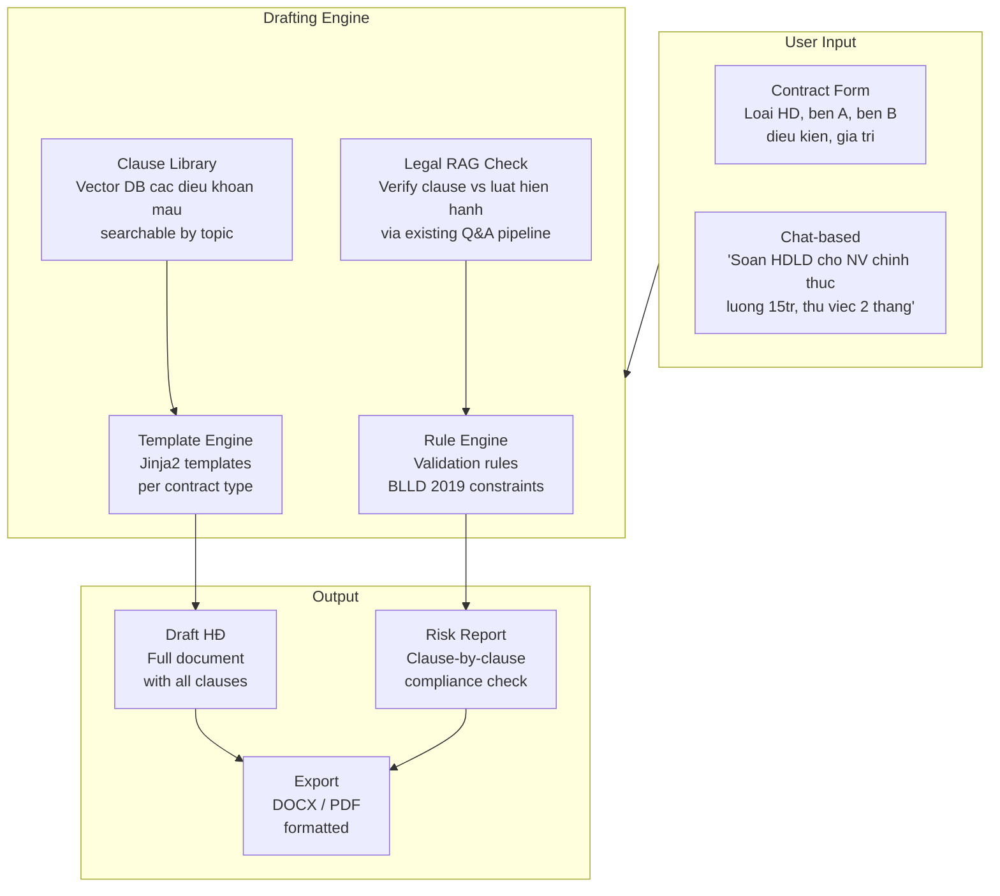

# SaaS Roadmap -- Legal Intelligence Platform

Ke hoach chuyen doi tu single-tenant Legal RAG thanh SaaS platform phuc vu chatbot phap luat va AI soan thao hop dong.

---

## 1. Tam nhin san pham

Tu mot RAG pipeline noi bo, phat trien thanh **Legal Intelligence Platform** voi 3 module chinh:

| Module | Mo ta | Trang thai |
|--------|-------|-----------|
| Legal Q&A Chatbot | Hoi dap van ban phap ly voi trich dan chinh xac | Core — da co nen tang |
| AI Contract Drafting | Soan thao hop dong tu dong, kiem tra phap ly | Moi — can xay dung |
| Document Analytics | Dashboard phan tich, canh bao, tuong thich | Gia tri gia tang |



---

## 2. Kien truc Multi-tenancy

### 2.1 Phuong an tenant isolation

| Phuong an | Mo ta | Phu hop |
|-----------|-------|---------|
| **A: Collection per tenant** | Moi tenant co Qdrant collection rieng (`legal_chunks_{tenant_id}`) | < 50 tenants (enterprise) |
| **B: Shared collection + filter** | 1 collection chung, payload `tenant_id` lam filter bat buoc | 50-1000 tenants (SMB) |
| **C: Cluster per tenant** | Qdrant cluster rieng | > 1000 tenants hoac yeu cau compliance |

**De xuat:** Bat dau voi phuong an A (Phase 1-2), chuyen sang B khi scale.

### 2.2 PostgreSQL data model



### 2.3 Authentication flow



---

## 3. Module 1: Legal Q&A Chatbot (nang cao)

### 3.1 Hien trang va gap

| Thanh phan | Hien trang (Phase 1) | Can bo sung cho SaaS |
|------------|---------------------|---------------------|
| Ingestion pipeline | 9 stages hoat dong | + Async queue (background jobs) |
| Query pipeline | Vector search only | + BM25 + RRF fusion |
| Multi-turn | Chua co | Query rewriter + Redis sessions |
| Validity filter | Chua co | Filter VB het hieu luc |
| Contradiction detection | Chua co | Multi-source conflict check |
| Citation engine | Basic | Extract quotes + validate |
| Billing/metering | Chua co | Query count, storage per tenant |

### 3.2 Cai tien cho SaaS

**Async ingestion queue:**
```
Upload file → API returns job_id → Background worker processes
→ Webhook/SSE notify completion
```

**Usage metering:**
| Metric | Free | Starter | Pro | Enterprise |
|--------|------|---------|-----|------------|
| Documents | 50 | 500 | 5,000 | Unlimited |
| Queries/month | 100 | 2,000 | 20,000 | Unlimited |
| Enrichment | Off | On | On | On + custom |
| Users | 3 | 10 | 50 | Unlimited |
| API access | No | Yes | Yes | Yes |

---

## 4. Module 2: AI Contract Drafting

### 4.1 Kien truc



### 4.2 Template types (giai doan dau)

| Loai | Template | Variables |
|------|----------|-----------|
| HDLD | Hop dong lao dong | ten, chuc_vu, luong, thu_viec, thoi_han |
| NDA | Thoa thuan bao mat | ben_A, ben_B, pham_vi, thoi_han, phat |
| Dich vu | HD dich vu | dich_vu, gia, thanh_toan, bao_hanh |
| Mua ban | HD mua ban | hang_hoa, so_luong, gia, giao_hang |
| Thue | HD thue | tai_san, gia_thue, thoi_han, dat_coc |

### 4.3 RAG-grounded validation

Khi AI soan clause, pipeline tu dong:
1. Extract yeu cau phap ly tu clause draft
2. RAG query: "Quy dinh phap luat ve {topic} cho loai hop dong {type}"
3. So sanh draft vs legal requirements
4. Flag vi pham + suggest correction

Vi du: Draft HDLD ghi "thu viec 90 ngay" → RAG retrieve BLLD 2019 Dieu 25 → Flag: "Toi da 60 ngay theo Khoan 1 Diem b" → Auto-correct

---

## 5. Module 3: Document Analytics

### 5.1 Dashboard features

| Feature | Mo ta | Data source |
|---------|-------|-------------|
| Compliance overview | % VB noi bo da bao phu yeu cau luat | Gap detector |
| Validity tracker | Bao nhieu VB het hieu luc chua cap nhat | Qdrant metadata |
| Cross-ref map | Visualization do thi VB lien quan | Relationship graph |
| Query analytics | Cau hoi nhieu nhat, topics thieu VB | Audit logs |
| Ingestion stats | Parse quality, chunk distribution | Document metadata |

---

## 6. Lo trinh phat trien

### Phase 1: Foundation Refactor (4 tuan)

| Task | Mo ta | Effort | Trang thai |
|------|-------|--------|-----------|
| Monorepo restructure | Tach `backend/` + `frontend/` | 2 ngay | **DONE** |
| PostgreSQL integration | SQLAlchemy models, Alembic migrations | 3 ngay | **DONE** |
| Auth system | JWT, user/tenant management | 4 ngay | Chua |
| Multi-tenancy (Qdrant) | Collection per tenant, filter injection | 3 ngay | Chua |
| Admin API | CRUD documents, users, tenants | 4 ngay | **DONE** (documents) |
| Next.js scaffold | Chat UI, admin dashboard, API client | 5 ngay | **DONE** |
| Docker + CI/CD | Updated compose, Dockerfiles, GitHub Actions | 2 ngay | **DONE** (compose + Dockerfiles) |

**Cap nhat:** Monorepo da duoc tach thanh `backend/` (FastAPI + SQLAlchemy) va `frontend/` (Next.js 15). PostgreSQL models (Tenant, User, Document, DocumentRelationship, AuditLog) da duoc trien khai. Admin API co CRUD documents + relationships. Frontend co Chat UI voi SSE streaming va Document management page. Docker Compose da co PostgreSQL 16 Alpine. Con lai: Auth system (JWT login/register) va Multi-tenancy (Qdrant collection per tenant).

### Phase 2: Q&A Enhancement (3 tuan)

| Task | Mo ta | Effort |
|------|-------|--------|
| BM25 + RRF fusion | Hybrid search Vietnamese-aware | 3 ngay |
| Validity filter | Filter/warn VB het hieu luc | 2 ngay |
| Citation engine | Extract quotes, validate Dieu/Khoan | 4 ngay |
| Cross-ref resolver | Follow tham chieu, recursive 1 cap | 3 ngay |
| Query rewriter | Multi-turn standalone query | 3 ngay |
| Semantic cache | Redis, threshold 0.97 | 1 ngay |

### Phase 3: Contract Drafting (4 tuan)

| Task | Mo ta | Effort |
|------|-------|--------|
| Template engine | Jinja2 + variable system | 3 ngay |
| Clause library | Vector DB dieu khoan mau | 4 ngay |
| Drafting pipeline | Template + clause + RAG validation | 5 ngay |
| Rule engine | Legal constraint validation | 4 ngay |
| Export (DOCX/PDF) | Formatted output generation | 3 ngay |
| Draft UI | Next.js form + preview | 3 ngay |

### Phase 4: AI Features (6 tuan)

| Task | Mo ta | Effort |
|------|-------|--------|
| Legal Impact Analysis | Clause-level diffing + cross-ref | 5 ngay |
| Compliance Gap Detector | Requirement extraction + matching | 5 ngay |
| Contract Risk Scoring | Clause anomaly detection | 5 ngay |
| Agentic multi-doc reasoning | Decompose + parallel retrieve + synthesize | 5 ngay |
| Legal Language Simplifier | LLM simplify + faithfulness check | 3 ngay |
| Proactive Legal Alert | Monitor + relevance + notification | 4 ngay |
| Legal Scenario Simulator | What-if analysis + decision tree | 5 ngay |

### Phase 5: Production + Scale (4 tuan)

| Task | Mo ta | Effort |
|------|-------|--------|
| Billing integration | Stripe/VNPay, usage metering | 5 ngay |
| Evaluation framework | Golden test set 100+ cau, auto-eval | 4 ngay |
| Performance tuning | Caching, connection pooling, load testing | 3 ngay |
| Security audit | Pen testing, prompt injection guard | 3 ngay |
| Documentation + onboarding | User docs, API docs, tenant setup guide | 3 ngay |
| Monitoring + alerting | Grafana, error tracking, SLA dashboard | 3 ngay |

### Tong ket

| Phase | Thoi gian | Nhan luc | Deliverable |
|-------|-----------|----------|-------------|
| Phase 1 | 4 tuan | 2-3 dev | Multi-tenant foundation + basic UI |
| Phase 2 | 3 tuan | 2 dev | Enhanced Q&A chatbot |
| Phase 3 | 4 tuan | 2-3 dev | Contract drafting MVP |
| Phase 4 | 6 tuan | 2-3 dev | 7 AI features |
| Phase 5 | 4 tuan | 2-3 dev | Production-ready SaaS |
| **Tong** | **~21 tuan** | **2-3 dev** | **Full platform** |

---

## 7. Chi phi uoc tinh (monthly, 100 tenants)

| Item | Uoc tinh |
|------|---------|
| LLM (DeepSeek + enrichment + drafting) | $300-600 |
| Embedding (Voyage AI) | $50-100 |
| Qdrant Cloud (100 collections) | $100-200 |
| PostgreSQL (managed) | $50-100 |
| Redis (managed) | $30-50 |
| S3 storage | $20-50 |
| Compute (2x app servers) | $200-400 |
| **Tong** | **$750-1,500/thang** |

### Pricing model

| Plan | Gia/thang | Target |
|------|----------|--------|
| Free | $0 | Trial, 50 docs, 100 queries |
| Starter | $49 | SME, 500 docs, 2k queries |
| Pro | $199 | Mid-size, 5k docs, 20k queries + drafting |
| Enterprise | Custom | Large org, unlimited, SLA, SSO |

**Break-even:** ~15 Starter tenants hoac 5 Pro tenants

---

## 8. Rui ro va giam thieu

| Rui ro | Xac suat | Impact | Giam thieu |
|--------|----------|--------|------------|
| Legal accuracy liability | Cao | Critical | Disclaimer bat buoc, audit trail, T=0.05, strict grounding |
| Data isolation breach | Thap | Critical | Qdrant collection isolation, PostgreSQL RLS, penetration testing |
| LLM cost spike | TB | High | Usage caps per tier, cache aggressive, model router |
| Vietnamese NLP quality | TB | Medium | Fallback unsegmented, custom dictionary, human QA |
| Competitor entry | TB | Medium | Moat: legal structure parser + cross-ref graph + data network effect |
| Regulatory change | Thap | Medium | Proactive alert system, auto-crawl vbpl.vn |
