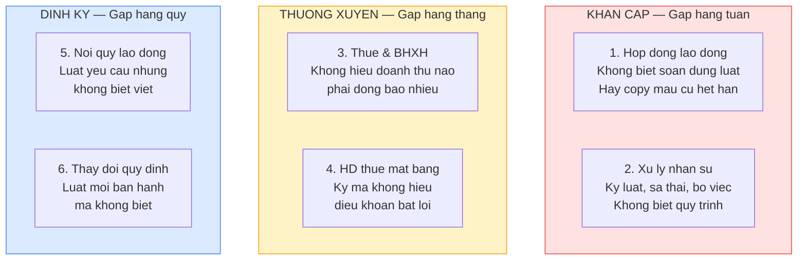
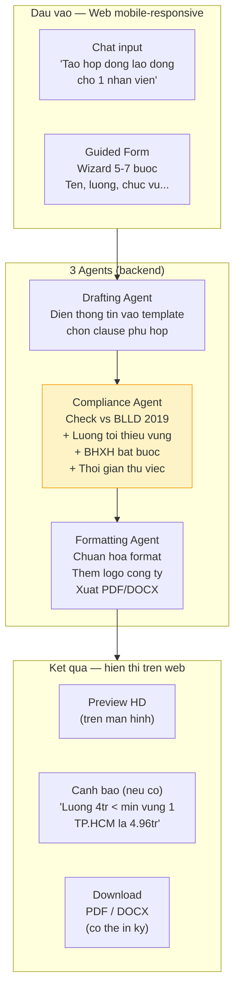
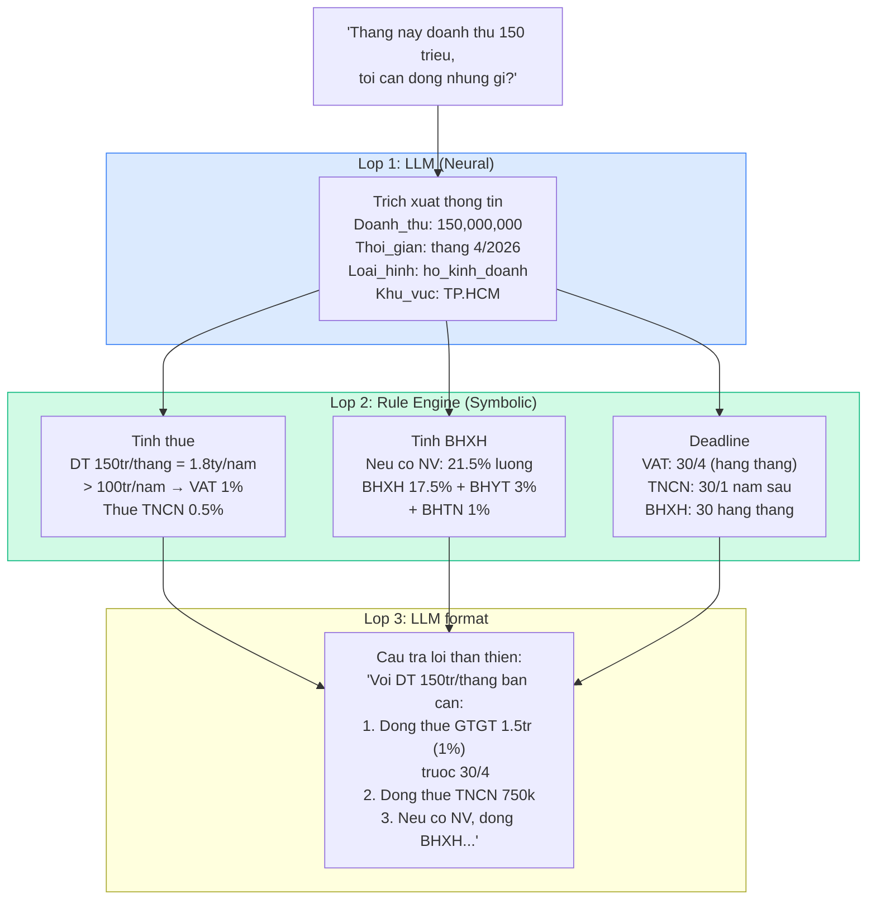
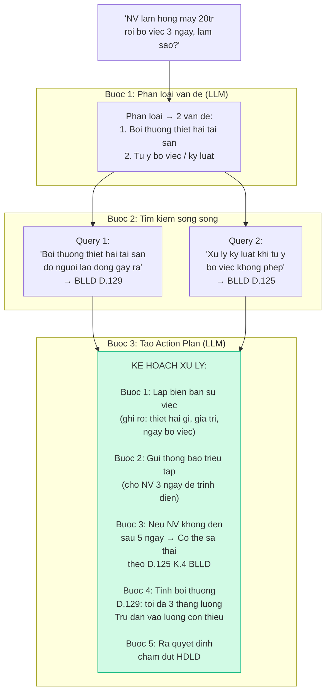
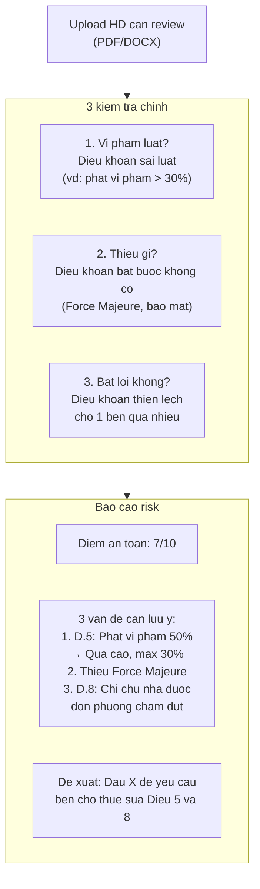
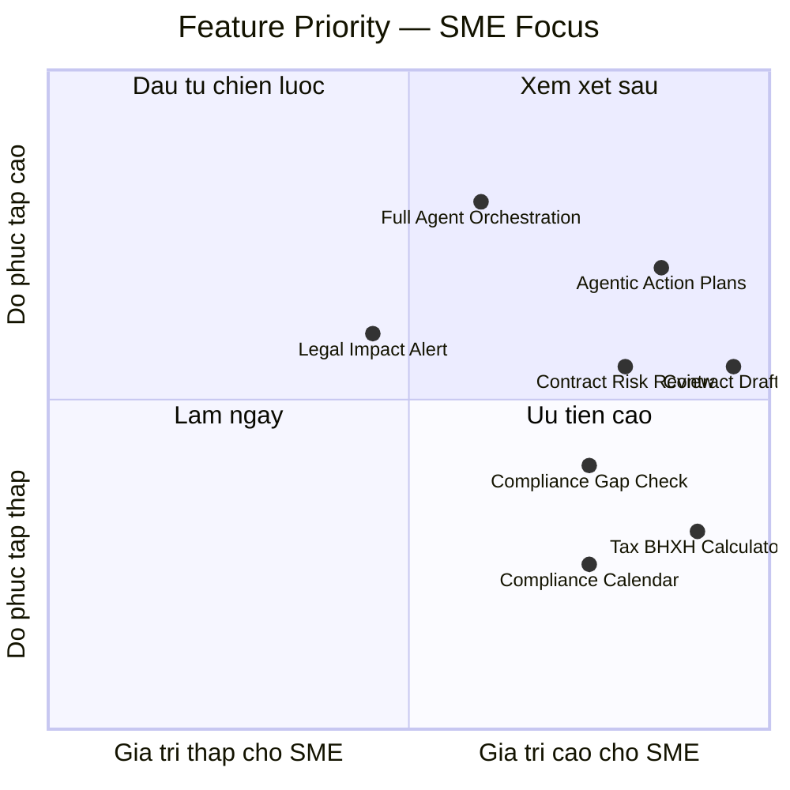
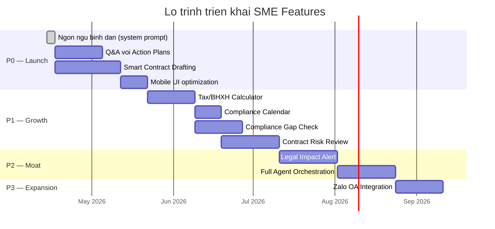
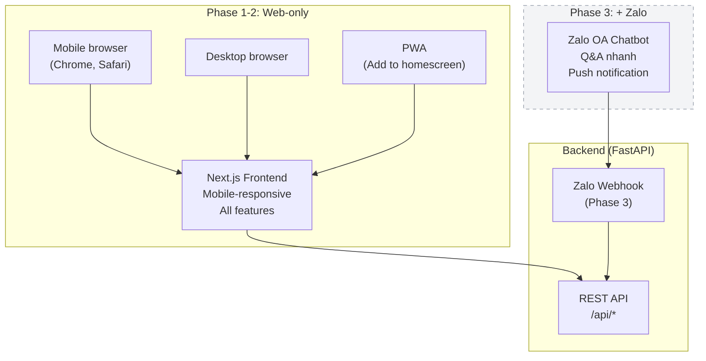

# Phan tich tinh nang cho tep khach hang SME & Ho kinh doanh

Tai lieu danh gia chi tiet cac tinh nang AI khi huong toi tep khach hang SME (doanh nghiep nho va vua) va ho kinh doanh nho le tai Viet Nam.

**Chien luoc kenh phan phoi:** Web app (Next.js) voi giao dien mobile-responsive la primary. Tich hop Zalo OA vao giai doan sau khi da co san pham on dinh.

---

## 1. Chan dung khach hang muc tieu

### 1.1 Quy mo thi truong

| Phan khuc | So luong (uoc tinh) | Vi du |
|-----------|---------------------|-------|
| Ho kinh doanh ca the | ~5 trieu | Quan ca phe, tiem toc, shop online, xe ban hang |
| Doanh nghiep sieu nho | ~600,000 | Studio, co so spa, xuong co khi, cua hang vat lieu |
| SME (10-200 NV) | ~200,000 | Cong ty xay dung nho, van phong ke toan, nha hang chuoi |

### 1.2 Dac diem hanh vi

| Dac diem | Mo ta | Anh huong toi san pham |
|----------|-------|----------------------|
| **Thiet bi** | 85%+ dung dien thoai de quan ly kinh doanh | **Mobile-responsive bat buoc**, moi man hinh phai hoat dong tot tren 375px |
| **Kenh giao tiep** | Zalo la kenh chinh (>76 trieu nguoi dung) | Tich hop Zalo giai doan sau. Giai doan dau dung web + bookmark tren dien thoai |
| **Ngon ngu** | Tieng Viet, thuong dung ngon ngu binh dan, khong chinh xac | NLU phai hieu "nghi phep" = "nghi viec" context-dependent |
| **Thoi gian** | Muon tra loi trong 30 giay, khong doc bao cao dai | Output phai la bullet points + action steps, KHONG phai dong dieu luat |
| **Tam ly** | So bi phat (thue, lao dong), khong biet minh dang sai | Tone "ban dong hanh" thay vi "luat su kho khan" |
| **Ngan sach** | 200k-1M VND/thang cho cong cu so (~$8-40) | Pricing VND, khong phai USD. $49/thang = qua dat cho phan lon SME |
| **So luong VB** | 5-20 van ban (HDLD, noi quy, HD thue) | UI don gian, khong can document management system phuc tap |
| **Nguoi ra quyet dinh** | Chu doanh nghiep = lam tat ca | 1 account, khong can multi-user phuc tap o Phase dau |

### 1.3 Top 6 noi dau phap ly (theo thu tu uu tien)



---

## 2. Danh gia 3 de xuat moi (tu nghien cuu)

### 2.1 Multi-Agent Contract Drafting

**Bai bao:** "Retrieval-Augmented Multi-Agent System for Rapid Statement of Work Generation" (arXiv:2508.07569)

#### Phan tich kha thi

| Tieu chi | Danh gia | Chi tiet |
|----------|---------|---------|
| **Gia tri cho SME** | **Rat cao** | Noi dau #1: SME can HD nhung khong co luat su. 90% SME VN dung HD mau cu, sai luat |
| **Do phuc tap** | Trung binh | 3 agents co the don gian hoa thanh pipeline tuyen tinh Phase 1 |
| **Chi phi LLM** | Thap-TB | ~3 LLM calls / HD (draft + check + format). DeepSeek ~$0.01/HD |
| **Rui ro** | Trung binh | Sai dieu khoan = sai phap ly. Can Compliance Agent CUNG + Disclaimer |
| **Kha nang monetize** | **Rat cao** | Thay the dich vu soan HD 500k-2M/ban. Pricing 50-100k/HD hop ly |
| **Thoi gian build** | 3-4 tuan | Template engine + Compliance rules + PDF export |

#### Thiet ke cu the cho SME



**Compliance Rules can hard-code cho SME (khong dung LLM):**

| Rule | Nguon luat | Logic |
|------|-----------|-------|
| Luong >= luong toi thieu vung | ND 74/2024/ND-CP | `IF luong < MIN_WAGE[region] THEN warn` |
| Thu viec <= 60 ngay (CD, CNC) | BLLD 2019 D.25 K.1 | `IF thu_viec_days > 60 AND job_type IN [cd, cnc] THEN error` |
| Thu viec <= 180 ngay (GD) | BLLD 2019 D.25 K.1 | `IF thu_viec_days > 180 AND job_type == 'gd' THEN error` |
| HDLD phai co 10 noi dung | BLLD 2019 D.21 | Check tung noi dung required co trong draft |
| Luong thu viec >= 85% | BLLD 2019 D.26 | `IF luong_tv < 0.85 * luong_chinh THEN warn` |
| Gio lam <= 48h/tuan | BLLD 2019 D.105 | `IF gio_tuan > 48 THEN error` |

**Template uu tien cho SME:**

| # | Template | Ly do | Do phuc tap |
|---|----------|-------|-------------|
| 1 | HDLD xac dinh thoi han | Nhu cau cao nhat, nhieu quy dinh bat buoc | TB |
| 2 | HDLD khong xac dinh thoi han | Tuong tu #1 nhung it hon | Thap |
| 3 | HD thu viec | Rat thuong dung, nhieu sai lam | Thap |
| 4 | HD thue mat bang | Noi dau #4, template don gian hon | TB |
| 5 | HD dich vu | Shop, freelancer thuong dung | Thap |
| 6 | Quyet dinh cham dut HDLD | Can khi sa thai nhan vien | Thap |
| 7 | Bien ban vi pham ky luat | Can khi xu ly ky luat | Thap |

**Ket luan: P0 — Build ngay. Day la tinh nang monetize truc tiep, gia tri ro rang nhat cho SME.**

---

### 2.2 Neuro-Symbolic Compliance (Zero-Hallucination Calculator)

**Bai bao:** "Neuro-Symbolic Compliance: Integrating LLMs and SMT Solvers for Automated Financial Legal Analysis" (arXiv:2601.06181)

#### Phan tich kha thi

| Tieu chi | Danh gia | Chi tiet |
|----------|---------|---------|
| **Gia tri cho SME** | **Rat cao** | Noi dau #3: SME tra ke toan 2-5M/thang chi de hoi "dong bao nhieu". AI lam duoc |
| **Do phuc tap** | **Thap** | Thue VN + BHXH la deterministic rules, KHONG can LLM suy luan |
| **Chi phi LLM** | Rat thap | LLM chi extract so. Rules engine tinh toan. ~$0.001/query |
| **Rui ro** | **Thap** | Rules hard-code = khong hallucinate. Con chinh xac hon LLM tu tinh |
| **Kha nang monetize** | Cao | Thay the cau hoi thang cho ke toan. Retention driver |
| **Thoi gian build** | 2-3 tuan | Rule base + LLM extraction + calendar |

#### Kien truc 2 lop



#### Rule base cho SME Viet Nam

**Thue (cap nhat theo luat hien hanh):**

| Loai hinh | Doanh thu | Thue GTGT | Thue TNCN |
|-----------|-----------|-----------|-----------|
| Ho KD (dich vu) | > 100tr/nam | 5% | 2% |
| Ho KD (thuong mai) | > 100tr/nam | 1% | 0.5% |
| Ho KD (san xuat) | > 100tr/nam | 3% | 1.5% |
| DN (VAT khau tru) | Tat ca | 8-10% | Thue TNDN 20% |

**BHXH (tu 1/7/2025):**

| Khoan | Nguoi lao dong | Nguoi su dung LD | Tong |
|-------|---------------|-----------------|------|
| BHXH | 8% | 17.5% | 25.5% |
| BHYT | 1.5% | 3% | 4.5% |
| BHTN | 1% | 1% | 2% |
| **Tong** | **10.5%** | **21.5%** | **32%** |

**Luong toi thieu vung (2024, ND 74/2024):**

| Vung | Muc |
|------|-----|
| Vung I | 4,960,000 |
| Vung II | 4,410,000 |
| Vung III | 3,860,000 |
| Vung IV | 3,450,000 |

**Uu diem cot loi: Rule engine KHONG BAO GIO sai so. LLM chi lam 2 viec: (1) hieu cau hoi, (2) format tra loi dep. Moi logic tinh toan deu la code cung.**

**Tinh nang bo sung — Lich tuan thu (Compliance Calendar):**

```
Moi thang:
  - Ngay 20: Han nop BHXH
  - Ngay 30: Han nop to khai thue GTGT (neu thang)

Moi quy:
  - Ngay 30 thang cuoi quy: Han nop to khai thue (neu quy)
  - Tam nop thue TNDN

Moi nam:
  - 30/1: Han quyet toan thue TNCN
  - 31/3: Han nop bao cao tai chinh + quyet toan thue TNDN
```

Thong bao qua web push notification + email: "Chu nhat nay la han nop BHXH thang 4. So tien can dong: 6,880,000d (cho 2 nhan vien). Bam de xem chi tiet."

Giai doan sau khi tich hop Zalo: push truc tiep qua Zalo OA.

**Ket luan: P1 — Build sau contract drafting. Do phuc tap thap, gia tri retention rat cao. Day la tinh nang khien SME quay lai moi thang.**

---

### 2.3 Agentic Search & Action Plans (L-MARS)

**Bai bao:** "L-MARS: Legal Multi-Agent Workflow with Orchestrated Reasoning and Agentic Search" (arXiv:2509.00761)

#### Phan tich kha thi

| Tieu chi | Danh gia | Chi tiet |
|----------|---------|---------|
| **Gia tri cho SME** | **Cao** | Noi dau #2: SME hoi cau hoi lon xon, can tra loi co cau truc |
| **Do phuc tap** | Cao | Full agent orchestration can nhieu iteration. Co the don gian hoa |
| **Chi phi LLM** | TB-Cao | 3-5 LLM calls / query (decompose + sub-queries + judge + synthesize) |
| **Rui ro** | TB | Nhieu buoc = nhieu cho sai. Can sufficiency check tot |
| **Kha nang monetize** | Cao | Thay the 1 buoi tu van luat su 500k-1M. Gia tri ro rang |
| **Thoi gian build** | 4-6 tuan | Agent framework + decomposition + synthesis |

#### De xuat: 2 pha trien khai

**Phase 1 (don gian) — Structured Decomposition:**

Khong can full agent framework. Dung predefined legal topic categories + parallel RAG.



**Phase 2 (nang cao) — Full Agent Orchestration:**

Them Judge Agent (kiem tra da du context chua), Web Search Agent (tim ban an, an le), va iterative retrieval. Chi can khi da co du luong users de justify do phuc tap.

#### So sanh voi Q&A hien tai

| Hien tai (Q&A don) | Agentic (de xuat) |
|--------------------|-------------------|
| Tra loi 1 cau hoi | Phan ra nhieu van de |
| Dan chieu Dieu/Khoan | Tao ke hoach hanh dong cu the |
| Thong tin tho | Buoc 1, 2, 3 co timeline |
| Nguoi dung phai tu tong hop | He thong tong hop san |
| "Theo Dieu 129..." (kho khan) | "Ban can lam 5 buoc sau..." (than thien) |

**Ket luan: P0 cho basic decomposition (nang cap Q&A hien tai), P2 cho full agent orchestration.**

---

## 3. Danh gia lai 7 tinh nang AI cu trong boi canh SME

### 3.1 Bang tong hop

| # | Tinh nang | Gia tri cho SME | Uu tien moi | Ly do chinh |
|---|-----------|----------------|------------|-------------|
| 1 | Legal Impact Analysis | TB | P2 | Huu ich nhung can crawl infra. Don gian hoa = push alert khi co VB moi |
| 2 | Compliance Gap Detector | **Cao** | **P1** | "Noi quy LD da du 7 muc bat buoc chua?" — rat actionable cho SME |
| 3 | Multi-doc Reasoning | Cao | → Merge vao Agentic Search | Trung lap voi de xuat #3 L-MARS |
| 4 | Contract Risk Scoring | **Cao** | **P1** | "Upload HD thue MB, AI kiem tra bat loi" — noi dau #4 |
| 5 | Legal Language Simplifier | **Rat cao** | **P0 (tich hop)** | Khong phai module rieng. Tich hop vao MOI cau tra loi |
| 6 | Proactive Alert | TB-Cao | P1 (→ Calendar) | Don gian hoa: lich nhac deadline, khong can monitoring |
| 7 | Scenario Simulator | TB | → Merge vao Action Plans | Output "buoc 1, 2, 3" da la scenario simulation |

### 3.2 Phan tich chi tiet tung tinh nang

#### (1) Legal Impact Analysis — P2 (don gian hoa)

**Ban goc:** Tu dong crawl VB moi → phan tich anh huong len VB noi bo cua tenant.

**Van de cho SME:** SME khong chu dong theo doi luat. Ho khong biet VB moi nao vua ban hanh, cang khong biet cai nao lien quan den minh.

**Don gian hoa kha thi:**
- **Khong crawl tu dong Phase dau.** Qua phuc tap, can infra rieng.
- Thay vao do: khi admin (platform) upload VB phap luat moi vao he thong chung, tu dong match voi document profile cua tung tenant.
- Thong bao: "Nghi dinh 74/2024 ve luong toi thieu da co hieu luc. Noi quy lao dong cua ban co the can cap nhat Dieu ve luong."
- Day la **Proactive Alert** ket hop **Impact Analysis** don gian.
- Effort: 3-4 tuan (phu thuoc vao Alert system)

**Ly do P2:** Can co du VB phap luat da index trong he thong chung truoc (shared legal corpus). Can co matching algorithm. Nen lam sau khi core features on dinh.

#### (2) Compliance Gap Detector — P1 (nang cap tu P2)

**Ban goc:** So sanh VB noi bo voi yeu cau phap luat bat buoc, phat hien thieu sot.

**Tai sao nang cap len P1 cho SME:**

SME co 2 loai van ban noi bo BAT BUOC phai co va THUONG XUYEN sai:

| Van ban | Bat buoc khi | Dieu luat | % SME co day du |
|---------|-------------|-----------|-----------------|
| Noi quy lao dong | >= 10 NV | BLLD 2019 D.118 | ~30% |
| HDLD (mau chuan) | Co NV | BLLD 2019 D.21 | ~50% (nhung hay thieu noi dung) |
| Thang bang luong | Tat ca DN | BLLD 2019 D.93 | ~20% |
| Quy che dan chu co so | >= 10 NV | ND 145/2020 D.48 | ~15% |

**Use case cuc ky cu the va actionable:**

```
SME upload noi quy lao dong (PDF/DOCX)
    ↓
System parse + check vs BLLD 2019 Dieu 118 Khoan 2:
    ✅ 1. Thoi gio lam viec, thoi gio nghi ngoi → Co (Dieu 5)
    ✅ 2. Trat tu tai noi lam viec → Co (Dieu 3)
    ❌ 3. An toan, ve sinh lao dong → THIEU
    ✅ 4. Bao ve tai san, bi mat → Co (Dieu 7)
    ❌ 5. Xu ly vi pham ky luat → THIEU noi dung cu the
    ✅ 6. Trach nhiem vat chat → Co (Dieu 9)
    ❌ 7. Phong chong quay roi tinh duc → THIEU (bat buoc tu 2021)
    ↓
Ket qua: 4/7 noi dung bat buoc ✅. Can bo sung 3 muc.
    ↓
De xuat: "Ban can bo sung Dieu ve An toan lao dong, Chi tiet xu ly ky luat,
          va Quy dinh chong quay roi tinh duc. Bam 'Tao tu dong' de AI soan giup."
```

**Ket noi voi Contract Drafting:** Khi Gap Detector tim thay thieu sot → de xuat "Tao dieu khoan nay tu dong" → chuyen sang Drafting Agent bo sung.

**Implementation:** Tan dung pipeline hien co:
- Structure Parser da parse duoc Dieu/Khoan
- Chi can them "Required Content Checklist" per document type (JSON config, khong can LLM)
- LLM chi can: match noi dung Dieu trong noi quy voi yeu cau bat buoc (semantic matching)
- Effort: 2-3 tuan

#### (3) Multi-doc Reasoning → Merge vao Agentic Search

Khong build rieng. Kha nang phan ra cau hoi + truy van nhieu nguon da duoc cover boi de xuat Agentic Search (Section 2.3). Trong pipeline, `asyncio.gather` cho parallel retrieval per sub-query la du.

#### (4) Contract Risk Scoring — P1 (giu nguyen)

**Ban goc:** Review hop dong tu doi tac, phat hien dieu khoan bat loi.

**Rat phu hop cho SME vi:**
- Noi dau #4: SME ky HD thue mat bang / HD dich vu ma khong hieu
- Chu quan ca phe ky HD thue 5 nam, khong biet dieu khoan "don phuong cham dut" cho phep chu nha duoi bat cu luc nao voi 30 ngay bao truoc
- SME khong co luat su review HD truoc khi ky

**Don gian hoa cho SME (khong can full 4-dimension analysis):**



**Uu diem so voi ban goc:** Bot 1 dimension (Market Benchmark) vi chua co du data. 3 dimensions con lai (Legal, Missing, Unfair) da du gia tri cho SME. Benchmark them vao Phase sau khi co nhieu HD da review.

**Effort:** 3-4 tuan. Tan dung Structure Parser + RAG pipeline hien co.

#### (5) Legal Language Simplifier — P0 (tich hop, khong build rieng)

**Khong phai tinh nang rieng.** Day la **cach viet** cua moi output trong he thong.

**Cach thuc hien:** Sua system prompt (`SYSTEM_PROMPT_VI` trong `backend/src/core/rag_engine.py`) va them post-processing rules:

| Quy tac | Truoc | Sau |
|---------|-------|-----|
| Dung ngon ngu thuong | "Theo quy dinh tai Dieu 129 Khoan 1 BLLD 2019, NLD phai boi thuong..." | "Theo luat, khi nhan vien lam hong do cua cong ty, ban co the yeu cau boi thuong (Dieu 129). Cu the..." |
| Them vi du thuc te | (khong co) | "Vi du: NV lam vo may tinh 15 trieu, ban co the tru toi da 3 thang luong cua ho" |
| Ket thuc bang action | (dung o thong tin) | "**Ban can lam:** 1. Lap bien ban, 2. Thoa thuan muc boi thuong..." |
| Giai thich thuat ngu | "...don phuong cham dut HDLD..." | "...don phuong cham dut hop dong (tuc la 1 ben tu y ngung hop dong ma khong can ben kia dong y)..." |

**Effort:** 2-3 ngay (chinh system prompt + test output quality).

#### (6) Proactive Alert → Compliance Calendar — P1 (don gian hoa)

**Ban goc:** Tu dong crawl VB moi, scoring relevance, push alert qua nhieu kenh.

**Don gian hoa cho SME:**

Khong can crawl. Chi can 2 tinh nang:

**A. Lich deadline co dinh (hard-code):**
- Deadline thue, BHXH, bao cao → set san theo loai hinh kinh doanh
- User chon: "Ho kinh doanh" / "Cong ty TNHH" → he thong tu tao lich
- Web push notification + email truoc 7 ngay va 1 ngay

**B. Cap nhat VB quan trong (admin-driven):**
- Khi platform admin upload VB phap luat moi quan trong (luong toi thieu moi, thay doi thue suat)
- He thong tu dong thong bao cac tenant bi anh huong
- Khong can crawl tu dong — admin curation dam bao chat luong

**Effort:** 1-2 tuan (lich co dinh + notification system).

Phase sau: them Zalo push, auto-crawl vbpl.vn.

#### (7) Scenario Simulator → Merge vao Action Plans

**Ban goc:** Input tinh huong → decision tree → timeline → action steps.

**Da duoc cover boi Agentic Search (Section 2.3):**
- Input: "NV lam hong may roi bo viec" (= mo ta tinh huong)
- Output: "Buoc 1: Lap bien ban. Buoc 2: Gui thong bao..." (= action plan voi timeline)
- Phan "Rui ro" va "Phuong an thay the" → them vao output template cua Agentic Search

Khong can UI rieng. Chat interface hien tai da phu hop.

---

## 4. Ma tran uu tien cuoi cung cho SME



### Lo trinh trien khai cho SME

| Phase | Tinh nang | Nguon goc | Mo ta | Effort |
|-------|-----------|-----------|-------|--------|
| **P0** | **Ngon ngu binh dan** | Cu (#5 - Simplifier) | Tich hop vao system prompt. Moi output = action-oriented + vi du | 2-3 ngay |
| **P0** | **Q&A voi Action Plans** | Moi (#3 - L-MARS basic) | Decompose → parallel search → action plan. Nang cap query pipeline | 2-3 tuan |
| **P0** | **Smart Contract Drafting** | Moi (#1 - Multi-Agent) | Draft + Comply + Format. 7 templates. PDF export. Guided form mobile | 3-4 tuan |
| **P0** | **Mobile UI optimization** | — | Toi uu responsive cho tat ca trang: chat, form HD, document list | 1-2 tuan |
| **P1** | **Tax/BHXH Calculator** | Moi (#2 - Neuro-Symbolic) | LLM extract → Rules calculate → LLM format. Zero hallucination | 2-3 tuan |
| **P1** | **Compliance Calendar** | Cu (#6 - Alert don gian hoa) | Lich deadline thue/BHXH + web push + email | 1-2 tuan |
| **P1** | **Compliance Gap Check** | Cu (#2 - Gap Detector don gian hoa) | Upload noi quy → check 7 muc bat buoc. Upload HDLD → check 10 muc | 2-3 tuan |
| **P1** | **Contract Risk Review** | Cu (#4 - Risk Scoring) | Upload HD → 3 kiem tra: vi pham, thieu, bat loi. Diem an toan X/10 | 3-4 tuan |
| **P2** | **Legal Impact Alert** | Cu (#1 - Impact don gian hoa) | Admin upload VB moi → match tenant profile → notify | 3-4 tuan |
| **P2** | **Full Agent Orchestration** | Moi (#3 - L-MARS full) | Judge + Web Search + iterative. Nang cap Agentic Search | 3-4 tuan |
| **P3** | **Zalo OA Integration** | — | Webhook + intent router + push notification qua Zalo | 2-3 tuan |

### Timeline tong hop



---

## 5. Chien luoc kenh phan phoi: Web Mobile-first

### 5.1 Tai sao Web mobile-responsive truoc, Zalo sau

| Tieu chi | Web mobile-responsive | Zalo OA | Quyet dinh |
|----------|----------------------|---------|------------|
| **Toc do trien khai** | Da co Next.js frontend, chi can toi uu responsive | Can dang ky OA, hoc Zalo API, build webhook layer | **Web truoc** |
| **Kiem soat UX** | Toan quyen: layout, animation, complex forms | Gioi han: text, buttons, carousel. Khong co form phuc tap | **Web cho tinh nang phuc tap** |
| **Contract drafting UX** | Full-screen form wizard, live preview, download | Chat-only, khong co form. File gui qua tin nhan | **Web bat buoc** |
| **SEO / Acquisition** | Indexable, shareable URL | Khong index, can QR scan/search | **Web cho acquisition** |
| **Auth / Account** | Full JWT flow, profile, history | Zalo user ID, gioi han | **Web cho account system** |
| **Push notification** | Web push + email (can permission) | Zalo push (SME da quen) | **Zalo tot hon — lam sau** |
| **Phan phoi link** | Chia se URL qua bat ky kenh nao | Can mo app | **Web linh hoat hon** |
| **Chi phi** | $0 (da co infra) | Zalo OA Pro 1.2M/nam + API costs | **Web re hon** |

**Ket luan:** Web la nen tang chinh vi:
1. Da co frontend (Next.js), chi can toi uu mobile
2. Contract Drafting BAT BUOC can web (form phuc tap, preview, download)
3. Full kiem soat UX, auth, account history
4. Zalo integration Phase 3 — chi cho Q&A nhanh + push notification

### 5.2 Yeu cau mobile-responsive

| Trang | Mobile priority | Ghi chu |
|-------|----------------|---------|
| Chat (Q&A) | **Cao nhat** | 70% usage tu mobile. Full-width input, touch-friendly |
| Contract Form | **Cao** | Wizard step-by-step, moi buoc 2-3 fields. Khong form dai |
| Contract Preview | TB | Cho phep pinch-zoom. Nut Download noi bat |
| Document List | TB | Card layout thay vi table tren mobile |
| Tax Calculator | **Cao** | Input don gian, ket qua noi bat voi so tien lon, mau ro |
| Compliance Report | TB | Checklist co icon ✅ ❌, collapse/expand sections |
| Calendar | **Cao** | Timeline vertical tren mobile, upcoming deadlines noi bat |

### 5.3 Kien truc kenh phan phoi



**PWA (Progressive Web App):**
Them vao Phase 1 — chi can `manifest.json` + service worker. SME co the "Add to Home Screen" tren dien thoai → truy cap nhu app, khong can App Store.

---

## 6. Pricing tai dinh vi cho SME Viet Nam

### 6.1 So sanh thi truong

| Dich vu hien tai | Chi phi SME dang tra | Platform thay the |
|-----------------|---------------------|-------------------|
| Ke toan thue (part-time) | 2-5M/thang | Tax/BHXH Calculator |
| Soan 1 HDLD (dich vu) | 500k-2M/ban | Contract Drafting |
| Tu van luat 1 lan | 500k-1M/buoi | Q&A + Action Plan |
| Luat su tu van hang thang | 3-10M/thang | Goi Pro |

### 6.2 Pricing model (VND)

| Goi | Gia/thang | Target | Bao gom |
|-----|----------|--------|---------|
| **Mien phi** | 0 | Thu nghiem | 10 cau hoi/thang, 1 HD mau/thang |
| **Co ban** | **199,000** (~$8) | Ho kinh doanh | Q&A khong gioi han, 5 HD/thang, Tax calculator |
| **Chuyen nghiep** | **499,000** (~$20) | SME 10-50 NV | Co ban + 20 HD/thang + Contract review + Calendar nhac + Gap check |
| **Doanh nghiep** | **999,000** (~$40) | SME 50-200 NV | Chuyen nghiep + Multi-user + Impact alert + Priority support |

**Break-even (uoc tinh chi phi $750-1500/thang):**
- ~100 goi Co ban, hoac
- ~40 goi Chuyen nghiep, hoac
- ~20 goi Doanh nghiep

---

## 7. Rui ro dac thu khi phuc vu SME

| Rui ro | Xac suat | Impact | Giam thieu |
|--------|----------|--------|------------|
| **AI tu van sai thue → SME bi phat** | TB | Critical | Rules engine hard-code (khong LLM tinh). Disclaimer ro rang o moi output |
| **HD soan sai → tranh chap lao dong** | TB | High | Compliance Agent kiem tra bat buoc. Template duoc luat su review. Version control |
| **SME khong biet dung (UX kho)** | TB | High | Mobile-responsive. Guided form wizard. Video huong dan 60s. In-app tooltips |
| **Churn cao (dung 1 lan roi bo)** | Cao | Medium | Calendar nhac hang thang → loi quay lai. Tax calculator → nhu cau dinh ky |
| **Doi thu (ChatGPT, Google)** | TB | Medium | Moat: (1) VN-specific rules hard-code, (2) PDF co the in ky, (3) Compliance check tu dong |
| **Luat thay doi** | Thap | Medium | Rule base cap nhat khi luat doi. Thong bao user "Da cap nhat luong toi thieu 2026" |

---

## 8. Ket luan va khuyen nghi

### Tong hop tinh nang theo nguon goc

| Nguon | Tinh nang | Uu tien SME | Ghi chu |
|-------|-----------|------------|---------|
| **Moi - Nghien cuu #1** | Multi-Agent Contract Drafting | **P0** | Monetize truc tiep. MVP = template + compliance rules |
| **Moi - Nghien cuu #2** | Neuro-Symbolic Tax/BHXH | **P1** | Zero hallucination. Retention killer |
| **Moi - Nghien cuu #3** | Agentic Search (basic) | **P0** | Decompose + action plan. Nang cap Q&A |
| **Moi - Nghien cuu #3** | Full Agent Orchestration | P2 | Judge + Web Search. Khi du user base |
| **Cu #1** | Legal Impact Analysis | P2 | Don gian hoa: admin-driven alert |
| **Cu #2** | Compliance Gap Detector | **P1** | Nang cap! "Noi quy da du 7 muc?" — rat actionable |
| **Cu #3** | Multi-doc Reasoning | — | Merge vao Agentic Search |
| **Cu #4** | Contract Risk Scoring | **P1** | "HD thue MB co 3 dieu bat loi" |
| **Cu #5** | Legal Language Simplifier | **P0** | Tich hop vao moi output, khong build rieng |
| **Cu #6** | Proactive Alert | **P1** | Don gian hoa → Compliance Calendar |
| **Cu #7** | Scenario Simulator | — | Merge vao Action Plans output |

### Nguyen tac thiet ke xuyen suot

1. **Output = Action, khong phai Information.** Moi cau tra loi ket thuc bang "Ban can lam...", khong phai "Theo Dieu X..."
2. **Web Mobile-first, Zalo Phase 3.** Toan bo tinh nang chay tren web responsive. Zalo chi them kenh phan phoi Q&A + push khi san pham on dinh
3. **Rules > LLM cho con so.** Bat cu gi co cong thuc xac dinh (thue, BHXH, luong toi thieu, thoi han) → hard-code. LLM chi xu ly ngon ngu
4. **199k/thang la moc gia.** Re hon 1 ly ca phe moi ngay. Gia tri = "luat su tui" 24/7
5. **Disclaimer o moi noi.** "Day la tham khao, khong thay the tu van phap ly chuyen nghiep" — bao ve phap ly cho platform
6. **PWA cho mobile experience.** Add to homescreen = truy cap nhu app. Khong can App Store
